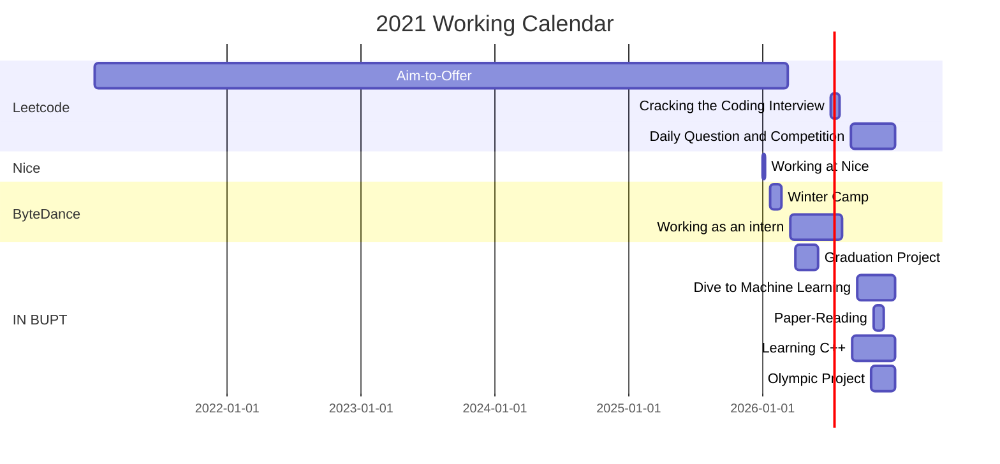

# Traveling Light —— Annual Summary 2021




---

## 2021年工作报告


### 目标实现了吗？

```shell
# 摘自《2020年工作总结》
这段时期，我的算法基础提升明显，三个月的时间里，力扣解题130+，剑指Offer被我前前后后刷了两遍，从一开始看到dfs，看到递归就头痛，到后来轻车熟路即使脑袋中的思路不那么清晰都能凭感觉写出正确算法，我能清楚地感受到自己的进步。但与计算机专业顶尖学生比起来，我的算法功底还差得很多，新的一年，我还需要在这一块继续提高。
```

去年的工作总结提到在算法层面需要做的更好，这一年总体有所提高。

- 今年`Leetcode`解题数从100+上升到了500+。

<div align="center">
    <br>
    <b>图1：Leetcode数据统计（2021）</b>
</div>


- 研一单人组队参与校程序竞赛（主要面向低年级的本科生），预赛做的特别好，进行过程中排名最高到第四位，但到了复赛只写出了签到题，跟高手还存在明显差距......

<div align="center">
    <br>
    <b>图2：程序设计竞赛校内预赛最高排名</b>
</div>


```shell
# 摘自《2020年工作总结》
回头看看，疫情笼罩的2020年，我与人交流的次数更少了，更多的时候是一个人做着自己的事情。不反对独行，但与人交流还是应该更频繁一点，不仅要做一个勤奋踏实的学生，也应该做一个活泼开朗的同学
```

从高中开始就一直有这个问题，不管做什么事情都喜欢一个人。独处的时间里不管做什么事情，都可以乐在其中，一点都不感到孤独，而且效率非常高。但这其实挺奇怪的。大四开始这种情况有一定好转，然后到研一感觉还是有些难以融入。挺佩服身边的同学能天天跟不同的同学在一起玩起来，不过感觉我的状态也会有人会羡慕吧哈哈哈哈哈。不管是“社交恐惧症”还是“社交牛逼症”，在和人交往的过程中保持坦诚是更重要的。不刻意去建立关系，也不排斥建立关系，有集体活动能参与尽量参与，没有时间也不强求。


```shell
# 摘自《2020年工作总结》
新年伊始，送自己一朵小红花，奖励自己2020的所有收获，也希望2021，只争朝夕，保持勤奋努力，早日实现发财大计！
```

今年一个最大的突破就是在字节跳动实习了半年，带来的额外收益就是有自己的小金库了。

<div align="center">
    <br>
    <b>图3：字节跳动家庭开放日 我和爸妈</b>
</div>


### 哪些方面有所提高？

#### - 代码能力的提高

今年大部分的学习时间都用在敲代码或者写笔记上了。如前文所述，今年代码能力提高了一些。


#### - 工程能力的提高

很多知识课上是永远也学不到的（实际上计算机专业的学生核心知识都是自学来的，比如代码能力，如果没有实践，这种能力上多少节课都不可能有提高）。在字节实习的半年时间，除了潜移默化的代码提升以外，也参与了一个项目从起步到上线的全过程，学习了很多工程上的用的比较多的技术，同时也发现了自己还有很多地方有明显的不足，知识树还有很多可以扩展延伸的地方。除了在实习阶段的提高，课余时间参与的一些项目也在提高这种能力。去年我开始独立维护自己的网页，今年用新的技术对网站进行了一次比较大的改造

<div align="center">
    <br>
    <b>图4：<a href="http://www.zhenghui.tech">导航栏</a>（http://www.zhenghui.tech)</b>
</div>

<div align="center">
    <br>
    <b>图5：<a href="http://www.zhenghui.tech/leetcode">Leetcode统计数据</a>（http://www.zhenghui.tech/leetcode)</b>
</div>


#### - 编程语言的扩展

去年写的代码基本上全部是python的，python比较适合用于快速入门算法与数据结构，在刚开始刷题的时候用python可以简化很多细节，把主要精力放在算法上。但在工程当中python用的还是相对少的（算法最终以C++落地，而后端主要用的是Java，Go等，python的特性使得它无法承担对代码执行效率有要求的任务）。因此，今年我着手熟悉了几门全新的语言。字节实习期间的后端全部用Go实现，当时还承担了一段时间的前端任务（当时前端缺人，后端改好了还得一并改了前端），字节的前端主要是React+Typescript，所以前端也接触了一些。上面的网页前端就是基于React+Typescript，后端基于Golang Gin框架实现的。九月份开学不久，我开始研究C++，并从11月开始，Leetcode上所有的题目都改用C++来做


#### - 总结与反思能力的提高

今年记笔记的手段发生了变化，总结的次数变多了，这是让自己比较惊喜的。

今年年初的时候发现用Typora Markdown记笔记比用其它的软件（OneNote、XMind）好多了，比方说：排版不需要思考、代码块可以随便加，公式可以自己写，笔记可以导出为pdf甚至是html的，图片还可以上传到图床等等，基本是吊打同类型的笔记软件了。而且，随着使用时间的推移，越来越多新的功能被发现，从3月一直到12月，用Typora写出来的东西非常明显变得更美观，更多样了。

今年从年初起开始每个月写月报。刚开始写的也是凌乱，没有什么纲领，就想到什么写什么；到现在，月报的内容、排版、各个方面明显有了进步。但最重要的是，定期的总结与复盘真的是很重要的，很多时候我们埋头拉车，却完全没有意识到方向早已偏离了自己的目标。定期花费一些时间回头看看走过的路，再抬头看看远方，趁自己的方向还没有偏的太远就及时纠正，这种时间的使用是很值得的。


### 哪些方面还有不足？


#### - 算法水平还不够

今年在算法方面有明显的进步，但是当前的水准还是不够。Leetcode题目做得不算少，但是掌握的算法和数据结构知识不算多。这里有一部分原因是Leetcode题目比较单一（比如：图算法的题目就非常少），也有一部分原因是自己花在总结上的时间少了。实际上一个够聪明的学生在新掌握了一项知识之后，下次再碰到就不会再犯错了，但前提是你得够聪明，有过目不忘的能力。如果没有，那还是应该老老实实多做总结，出现一个新知识点，以写笔记的方式强化自己的记忆，同时也方便后面遇到类似的问题做一个参考。今年年底参加了几次Leetcode的周赛，明显感觉到自己的水平还有很大的不足，之前还是坐井观天了，新的一年还是要沉下心去琢磨这些问题。年底我着手对一些比较常见的算法进行了整理，希望后面能写得更加丰富

[【算法笔记（2021）】](http://123.57.66.63:8001/html/%E7%AE%97%E6%B3%95%E7%AC%94%E8%AE%B0.html)


#### - 基础不扎实

基本功还差得很远。看CSAPP的过程中才发现，计算机底层的知识学得太差了。比如基本的二进制位运算，就非常不熟悉，之前算法题碰到了也是很头疼，CSAPP第一个比较简单的实验也是从第一题开始蒙到最后一题，基本上是得零分的节奏。操作系统、计组、计网的知识需要重新学。

数学知识也有明显的欠缺，大一大二学的数学知识忘记了95%以上。虽然不是数学专业，但是基本的图论、数论知识需要掌握。新的一年，计划把几门核心课程（高数、线代、概率、离散、图论、数论、组合）全部重新过一遍

英语全忘了，大二的时候英语好像也还行，现在英语课让翻译句子一点都不行。看CF的算法题也是效率低，一个题还没看明白就不想看了，硬着头皮看还会经常理解错题意。


#### - 对未来方向的把握的还不清楚

未来的发展方向一直都没有想清楚，一直在犹豫。今年的主要工作都是围绕工程实践展开的，这一段时间也感觉自己可能还是更适合走工程路线，算法啥的好像不太行。也是由于实习的缘故，本科的毕业设计虎头蛇尾，做得实在是太差了。身处校园，跟在企业当中还是不同，至少我得有研究成果确保自己能安稳毕业才行，拿毕业证书的优先级肯定还是要高于到处实习的。因此接下来的一年我可能需要花更多的时间在对某一个领域的深入研究上而非是提高自己的工程能力了。应该在确保能毕业的条件下再考虑其他问题。


#### - 有些盲目自信

也是自己一直以来的问题，太飘了，盖了三层楼尾巴能翘到第十层，高估了自己的同时又低估了别人。去实习之前觉得，啊，能去字节实习真的好牛啊；然后机缘巧合真给我发了offer，哇，感觉自己好牛啊；再然后夏天走在学校路上，200米的路上打照面的穿字节文化衫的同学真是一个接着一个......好像也没那么牛。作为非科班出身的学生，还是应该打好基本功，补齐专业课知识，不应该被一时带有运气成分的得意打乱了节奏，冲昏了头脑。“务实的浪漫主义”的前提还得是“务实”。

思考问题的深度不够，有时候想问题会过于理想化。很多事情都是”我以为“怎么怎么样，但实际上可能并不是这样。实际情况往往比想象的要复杂得多，然而自己却浑然不觉


#### - 表达能力太差

做事情有点太”独“了，因此显得有些格格不入（如前文所述）。本身语文水平就很差，然后又不喜欢跟别人交流，结果就是沟通能力的下降。同样一件事情，别人三两句话说出来，立马就觉得他说的好有道理，我好认同；但是一轮到自己来表达，就说不明白了


#### - 消费观出现了一些问题

2021年的  [月消费清单](#2021年财务情况)  在后面详细列出了

这个问题在意料之外，我记得大一的时候一个月最多花1000块出头，然后大二、大三会逐年增加一点点，但总体还算是在谱上。到了今年涨幅有些离谱，明年开始需要明确控制

<div align="center">
    <br>
    <b>图6：2020年消费统计</b>
</div>
与去年相比，消费总金额上涨了123%，从36553上升到81500左右。日常开销上涨了129%，从18565上升到42500左右。

收入很大程度上影响了消费，去年的消费也是受到疫情的影响，在家里的消费水平挺低的。但不管怎么算，今年居然比去年多花这么多钱，这不应该。我属于对金钱没啥概念的人，有钱了就花的大手大脚的，没钱了就只能克制一点。现在意识到这种想法还是有问题的。今年本可以攒下数目非常可观的钱，但遗憾很多都被挥霍了。


### 2022年的OKR？


#### - O1. 提升代码能力

- K1. 2022年Leetcode解题数上1000
- K2. Leetcode竞赛分数打上2150+（国内前1000名）
- K3. C++由掌握到熟悉，看完Effective系列

#### - O2. 夯实基本功

- K1. 强化计算机基础知识，CSAPP题目做完，能理解所有实验内容及代码
- K2. 找回数学知识，全面复习几门核心课程
- K3. 提高英语水平，开始阅读英文文献，下半年实现用英文刷题

#### - O3. 着手科研

- K1. 精读论文50篇
- K2. 找到自己的研究方向，在年末有把握提前达到毕业要求

#### - O4. 拓展工程能力

- K1. 学习Redis、Hadoop相关大数据技术
- K2. 有空余时间的话考虑腾讯实习一段时间

#### - O5. 控制消费

- K1. 2022年，控制自己的日常月消费在2200以内


---

## 2021年重点笔记整理


- [【剑指Offer回顾（python）】](http://123.57.66.63:8001/monthly_report/%E5%89%91%E6%8C%87Offer%E5%BF%AB%E9%80%9F%E5%9B%9E%E9%A1%BE;%E7%AE%97%E6%B3%95,%E5%88%B7%E9%A2%98.pdf)
- [【Git使用手册】](http://123.57.66.63:8001/monthly_report/Git%E4%BD%BF%E7%94%A8%E6%8C%87%E5%8C%97;git,%E6%95%99%E7%A8%8B.pdf)
- [【Docker使用手册】](http://123.57.66.63:8001/html/Docker%E5%85%A5%E9%97%A8.html)
- [【动手学深度学习笔记】](http://123.57.66.63:8001/html/%E5%8A%A8%E6%89%8B%E5%AD%A6%E6%B7%B1%E5%BA%A6%E5%AD%A6%E4%B9%A0%E7%AC%94%E8%AE%B0.html)
- [【论文精读】](http://123.57.66.63:8001/html/%E8%AE%BA%E6%96%87%E7%B2%BE%E8%AF%BB.html)
- [【C++ Primer Plus笔记】](http://123.57.66.63:8001/html/C++%20Primer%20Plus%E7%AC%94%E8%AE%B0.html)
- [【算法笔记】](http://123.57.66.63:8001/html/%E7%AE%97%E6%B3%95%E7%AC%94%E8%AE%B0.html)


---

## 2021年收藏内容


这一部分今年没注意整理，感觉看了挺多的但是没存下来

- [【罗翔：毕业坦白局】](https://www.bilibili.com/video/BV1y64y167Sf?from=search&seid=5552881982169003680&spm_id_from=333.337.0.0)
- [【罗翔：剧本与舞台】](https://www.bilibili.com/video/BV1ay4y1V7XG?from=search&seid=7025338887649557634&spm_id_from=333.337.0.0)
- [【图书馆30秒：感情的原则与界限】](https://www.zhihu.com/question/309282780/answer/868991240)
- [【张一鸣：大学四年收获及工作感悟】](https://mp.weixin.qq.com/s/4OcC0V32hZ8p9KsZceITKw)
- [【北航计算机系本科生从零开始到ssp历程】](https://github.com/mio4/Java-Gold/blob/master/01-campus/2019-campus-interview.md)
- [【李沐：用梯度下降来优化人生】](https://www.bilibili.com/read/cv13335461?spm_id_from=333.999.0.0)
- [【北邮人论坛View：读研和未来】](https://bbs.byr.cn/#!article/WorkLife/1162029)


- [【请回答1988】](https://movie.douban.com/subject/26302614/)
- [【非自然死亡】](https://movie.douban.com/subject/27140017/)
- [【鱿鱼游戏】](https://movie.douban.com/subject/34812928/)
- [【国王排名】](https://movie.douban.com/subject/34927946/)
- [【82年生的金智英】](https://movie.douban.com/subject/30327842/)
- [【花束般的恋爱】](https://movie.douban.com/subject/34874432/)
- [【阳光普照】](https://movie.douban.com/subject/30292777/)


---

## 2021年月报

- [【二月月报】](http://123.57.66.63:8001/html/2021-02.html)
- [【三月月报】](http://123.57.66.63:8001/html/2021-03.html)
- [【四月月报】](http://123.57.66.63:8001/html/2021-04.html)
- [【六月月报】](http://123.57.66.63:8001/monthly_report/2021-06;%E6%AF%95%E4%B8%9A,%E4%B8%BB%E9%A1%B5%E9%87%8D%E6%9E%84,react+ts,%E6%AF%95%E4%B8%9A%E5%9D%A6%E7%99%BD%E5%B1%80.pdf)
- [【七月月报】](http://123.57.66.63:8001/monthly_report/2021-07;%E4%B8%BB%E9%A1%B5%E9%87%8D%E6%9E%84,%E6%9A%91%E6%9C%9F%E8%AF%BE%E7%A8%8B.pdf)
- [【八月月报】](http://123.57.66.63:8001/html/2021-08.html)
- [【九月月报】](http://123.57.66.63:8001/html/2021-09.html)
- [【十月月报】](http://123.57.66.63:8001/html/2021-10.html)
- [【十一月月报】](http://123.57.66.63:8001/html/2021-11.html)
- [【十二月月报】](http://123.57.66.63:8001/html/2021-12.html)


---

## 2021年财务情况

因为没有花更多的时间详细整理核实，可能有些细节存在误差，但大体上看没有问题


### 支出情况

<div align="center">
    <br>
    <b>图7：日常消费支出对比</b>
</div>


<table style="text-align:center">
    <tr>
    	<th>月份</th>
        <th>总支出</th>
        <th>日常支出</th>
        <th>备注</th>
    </tr>
    <tr>
    	<td>一月</td>
        <td>5168</td>
        <td>3526</td>
        <td></td>
    </tr>
    <tr>
    	<td>二月</td>
        <td>4987</td>
        <td>3044</td>
        <td></td>
    </tr>
    <tr>
    	<td>三月</td>
        <td>4506</td>
        <td>4060</td>
        <td></td>
    </tr>
    <tr>
    	<td>四月</td>
        <td>5991</td>
        <td>3531</td>
        <td></td>
    </tr>
    <tr>
    	<td>五月</td>
        <td>17944</td>
        <td>5084</td>
        <td>正畸缴费：12500</td>
    </tr>
    <tr>
    	<td>六月</td>
        <td>4098</td>
        <td>3017</td>
        <td></td>
    </tr>
    <tr>
    	<td>七月</td>
        <td>4080</td>
        <td>2957</td>
        <td></td>
    </tr>
    <tr>
    	<td>八月</td>
        <td>17546</td>
        <td>4978</td>
        <td>学费：8900；请大家庭吃饭：1847</td>
    </tr>
    <tr>
    	<td>九月</td>
        <td>3352</td>
        <td>3352</td>
        <td></td>
    </tr>
    <tr>
    	<td>十月</td>
        <td>2946</td>
        <td>2796</td>
        <td></td>
    </tr>
    <tr>
    	<td>十一月</td>
        <td>3370</td>
        <td>3370</td>
        <td></td>
    </tr>
    <tr>
    	<td>十二月</td>
        <td>6585</td>
        <td>3017</td>
        <td>妈妈的手机：4699</td>
    </tr>
    <tr>
    	<td>合计</td>
        <td>80583</td>
        <td>41323</td>
        <td>衣服：4632；电子产品、球拍：2044；爸妈的礼物：6198；爸妈的分红：5310</td>
    </tr>
</table>

