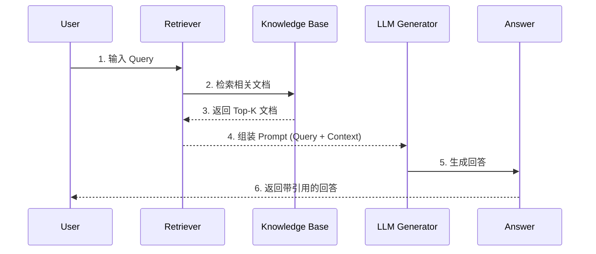

# RAG（检索增强生成）

RAG（Retrieval-Augmented Generation，检索增强生成）是一种将**检索系统**与**生成式模型**结合的 AI 技术架构，通过外部知识库增强 LLM 的回答能力。

<!-- more -->

## 背景与动机

LLM 存在固有问题：

| 问题 | 描述 | RAG 解决方案 |
|------|------|-------------|
| **知识时效性** | 训练数据有截止日期，无法获取最新知识 | 实时检索外部知识库 |
| **幻觉（Hallucination）** | LLM 可能生成看似合理但错误的内容 | 回答基于检索到的证据 |
| **私有知识** | 无法直接访问企业私有数据 | 检索私有知识库 |
| **可追溯性** | 难以确定回答的知识来源 | 显式提供引用来源 |

## 核心架构


### 三阶段流程

1. **检索（Retrieval）**：给定查询，从知识库中取出相关文档
2. **增强（Augmented）**：将检索结果与原 query 拼接为上下文
3. **生成（Generation）**：LLM 基于增强后的 prompt 生成回答

## 关键技术

### 检索器（Retriever）

| 类型 | 原理 | 适用场景 |
|------|------|----------|
| **稀疏检索（Sparse）** | BM25、TF-IDF，基于词频 | 关键词匹配 |
| **稠密检索（Dense）** | Embedding 向量相似度 | 语义匹配 |
| **混合检索（Hybrid）** | 稀疏 + 稠密融合 | 通用场景 |

### 向量数据库

用于存储文档的稠密向量表示，支持高效相似度检索：

- **Faiss**：Facebook 开源向量检索库
- **Milvus**：开源向量数据库
- **Pinecone**：云服务向量数据库
- **Weaviate**：开源向量搜索引擎

### 生成器（Generator）

通常使用预训练 LLM：

- GPT 系列（OpenAI）
- Claude 系列（Anthropic）
- Llama 系列（开源）
- DeepSeek 系列

### 向量相似度度量

| 度量方式 | 原理 | 特点 | 适用场景 |
|----------|------|------|----------|
| **欧氏距离（L2）** | 衡量向量空间中的绝对距离 | 值越小越相似 | 模型或索引明确按 L2 优化 |
| **内积（IP）** | 向量点积 | pgvector 返回负内积，值越小越相似 | 向量已归一化、追求计算效率 |
| **余弦距离（Cosine）** | 向量夹角余弦值 | 对长度不敏感，值越小越相似 | 文本语义检索、RAG 最常用 |

!!! tip "为什么 RAG 常用余弦相似度"
    文本语义检索更关心方向是否接近，而不是向量长度本身。余弦距离对长度不敏感，更适合判断语义相似。如果 Embedding 模型输出已经归一化，内积和余弦在排序上通常等价，内积计算会更直接。

### 向量索引算法

**精确最近邻（ENN）**：100% 找到最相似的向量。KD-Tree、VP-Tree 等低维空间效果好，但 AI 领域向量动辄几百上千维，容易遇到维度灾难，退化成暴力搜索。

**近似最近邻（ANN）**：现代向量检索主流。接受工程取舍——不保证 100% 找到绝对最近邻，用一点召回损失换取几个数量级的速度提升。

**主流 ANN 算法对比：**

| 算法 | 原理 | 核心优势 | 主要劣势 | 适用场景 |
|------|------|----------|----------|----------|
| **Flat** | 遍历所有向量计算距离 | 100% 准确无损 | 数据量大时查询慢 | 小规模、低 QPS、离线评测 |
| **HNSW** | 分层导航的小世界图 | 查询快，召回率高 | 内存消耗大，构建耗时 | 中大规模、高召回、低延迟 |
| **IVFFLAT** | 聚类 + 倒排索引桶 | 内存效率较好，构建较快 | 需前置训练，召回率略低 | 更关注内存和构建速度 |
| **IVF-PQ** | 聚类 + 向量极致压缩 | 支持海量数据，开销低 | 精度损失较大 | 超大规模、内存敏感 |
| **IVF_RABITQ** | 聚类 + 随机旋转比特量化 | 内存占用低，召回率优于传统 PQ | 较新算法，生态仍在演进 | 超大规模、内存敏感 |

**HNSW 核心机制：**

- **层次化构建**：节点最高层级由公式 `level = floor(-ln(random()) * mL)` 决定，越高层节点数指数级递减
- **贪心搜索**：检索从顶层开始，每层移动到距离查询点最近的邻居节点
- **由粗到精**：上层负责快速定位语义区域，下层负责精细查找候选近邻

**HNSW 调参：**

| 参数 | 常见范围 | 调大后的影响 | 调优建议 |
|------|----------|--------------|----------|
| `m` | 8-64 | 图更密，召回率更高，内存和构建时间增加 | 先用默认值 16，召回不够再调 |
| `ef_construction` | 64-256+ | 索引质量更好，但构建更慢 | 离线构建能接受更慢时再调大 |
| `ef_search` | 40-200+ | 查询召回更高，但延迟增加 | 最适合在线调参，用评测集找平衡点 |

**HNSW vs IVFFLAT：**

| 特性 | HNSW（图索引） | IVFFLAT（倒排聚类） |
|------|----------------|---------------------|
| 底层原理 | 层次化小世界图结构 | 聚类 + 倒排桶结构 |
| 查询速度 | 通常更快，召回更稳定 | 取决于 lists 和 probes |
| 内存消耗 | 较高（原始向量 + 图连接指针） | 通常低于 HNSW |
| 构建速度 | 较慢，逐个节点插入 | 较快，但需聚类训练 |
| 适用场景 | 中大规模、高召回、低延迟 | 更关注内存和构建速度 |

!!! warning "过滤条件下的索引失效"
    pgvector 的 HNSW 索引遇到 WHERE 过滤条件时，要看执行计划。近似索引通常先按向量距离找候选，再应用过滤条件。如果过滤条件很严格，最终结果可能少于 Top-K 预期。常见处理方式：增大候选集、预过滤（可能退化为暴力扫描）、部分索引（Partial Index）、迭代索引扫描（pgvector 0.8.0+）。

### 向量数据库选型

| 类型 | 代表方案 | 优点 | 缺点 | 适用规模 |
|------|----------|------|------|----------|
| **传统数据库扩展** | PostgreSQL + pgvector、MongoDB Atlas | 技术栈统一，事务一致性好，SQL 过滤方便 | 百万级以上性能下降 | < 100 万向量 |
| **搜索引擎演进** | Elasticsearch、OpenSearch | 混合搜索能力强，分布式成熟 | 学习成本高，资源消耗大 | 已用 ES 的团队 |
| **原生专业向量数据库** | Milvus、Weaviate、Qdrant | 多种索引算法，分布式和大规模场景成熟 | 多一套系统，多一套运维 | 百万到亿级 |
| **云托管服务** | Pinecone、Zilliz Cloud、Weaviate Cloud | 运维负担低，自动扩缩容 | 成本高，数据在第三方 | 任意规模，不想自运维 |

**选型建议：**
- 规模 < 100 万，团队已有 PostgreSQL → pgvector
- 规模 < 100 万，团队已有 ES → ES 向量检索
- 规模百万到十亿级 → Milvus、Qdrant、Weaviate
- 不想自运维 → Pinecone、Zilliz Cloud

!!! note "为什么不选 MySQL"
    MySQL 8.x 没有官方 VECTOR 类型，MySQL 9.x 引入了 VECTOR 类型但还不是成熟的生产级 ANN 检索方案。如果项目已深度绑定 MySQL，可以继续用 MySQL 存业务数据，搭配 pgvector、Milvus 等外部向量检索组件。

## 工程链路：离线索引 + 在线推理

RAG 系统工程上分为两个独立阶段，职责分离，流水线运行。

### 阶段一：离线索引（Indexing）

将原始文档处理后存入向量数据库，供在线检索使用。

**完整管线包含 6 个环节：**

| 环节 | 典型问题 | 最终影响 |
|------|----------|----------|
| **文件上传** | 格式伪造、大小超限、编码混乱 | 解析器崩溃或静默失败 |
| **格式校验** | 扩展名和实际 MIME 类型不符 | 选错解析器 |
| **Layout 解析** | PDF 多栏、表格合并单元格、页眉页脚 | 结构丢失、上下文错位 |
| **清洗去噪** | 乱码、特殊字符、重复空行、目录残留 | 噪声入索引、Embedding 失真 |
| **Chunking** | 语义截断、上下文断裂、块太大或太小 | 召回不准、答案残缺 |
| **Metadata** | 没保存来源、页码、版本、权限 | 无法过滤、无法引用 |

!!! tip "核心观点"
    **RAG 的上限由数据质量决定，下限由检索策略决定。** 把数据处理管线做到位，比换一百个 embedding 模型都管用。

### 文档解析与清洗

不同文档格式的处理要点：

| 格式 | 解析重点 | 推荐工具 |
|------|----------|----------|
| **PDF** | 多栏布局、合并单元格、页眉页脚 | Layout-Aware Parser（LlamaParse、Docling、Marker-PDF） |
| **Word** | 标题层级（Heading 1/2/3） | `python-docx` 读取样式信息重建文档树 |
| **Excel** | 按行/区域提取为结构化 JSON | 按用途分类处理：数据表格、配置表格 |
| **Markdown** | 按标题层级（H1/H2/H3）切 | `MarkdownHeaderTextSplitter` |
| **扫描件** | OCR 质量控制 | Tesseract 4.x+、Google Document AI、AWS Textract |

!!! warning "PDF 多栏布局的坑"
    很多 PDF 是双栏排版，但底层文本流可能是混乱的——第一栏的第三段后面可能跟着第三栏的第一段。解析时如果按物理顺序读，会得到一堆乱码。最靠谱的做法是用 Layout-Aware Parser，识别文本的物理位置（x、y 坐标）、字体大小、段落间距，推断出真实的阅读顺序。

### Chunking 策略详解

**1. 固定长度切分**

最朴素的做法：按字符数或 Token 数硬切，如每 1000 Token 切一块，相邻块重叠 200 Token。

- 优点：实现简单、行为可预测
- 缺点：不懂段落、表格、代码块边界，容易把语义截断
- 适用：快速验证 RAG 可行性的基线测试

实测固定 512-token 切分与递归切分差距约 2 个百分点。

**2. 递归字符切分（Recursive Character Splitting）**

按换行符 → 句号 → 空格逐层往下切，直到每个块都小于目标大小。

- 优点：保留层级结构，适合段落长短不一的文档
- 适用：技术博客、产品手册、研究报告

**3. 语义切分**

用 Embedding 模型判断句子之间的语义相似度，把意思相近的句子聚成一组。

- 优点：按意义分，语义完整
- 缺点：易产生超小块（平均 43 Token），上下文严重不足；额外 embedding 调用成本高
- 优化：设置 `min_chunk_size`（200-400 Token）避免超小片段

**4. 按文档结构切分**

如果文档本身有清晰的结构，按结构切是最靠谱的。

| 文档类型 | 推荐切分方式 |
|----------|--------------|
| Markdown | 按标题层级（H1/H2/H3）切 |
| HTML | 按标签层级切（h1~h6、p、div） |
| PDF | 按页或章节切 |
| 代码 | 按函数、类、包边界切 |
| 论文 | 按章节、段落、表格切 |

!!! tip "Page-Level Chunking 适用场景"
    金融报告、法律文档等本身页面边界就携带语义。这类文档按页切分平均准确率最高，方差也最低。

**5. Parent-Child Chunk**

解决"小块召回准但上下文残缺，大块保留完整但召回噪声大"的矛盾：

- 子 Chunk：300 Token 左右，用于向量检索
- 父 Chunk：1200 Token，挂载在子 Chunk 上
- 检索时：先命中小块，再把对应父段落放入上下文

- 适用：长文档、教程、政策解读、故障手册
- 缺点：索引存储量增加，检索时多一次关联查询

**6. 重叠控制（Overlap）**

连续两页讲同一件事，但被页码硬切开。重叠是应对边界问题的标准手段。

| 文档类型 | 建议重叠 |
|----------|----------|
| 通用文本 | 512 Token 块 + 50-100 Token 重叠 |
| 代码 | 按函数/类边界切，不用硬套 Token 数 |
| 法规合同 | 按条、款、项结构切，保留法律效力单元 |
| 表格密集文档 | 表格单独作为一块，绝不能跨块切分 |

### 语义丢失问题

**典型场景：**

1. **结构截断**：完整业务逻辑被拆到两个 Chunk，边界处关键条件被切散
2. **上下文蒸发**：Chunk 只保留文本内容，丢失在文档里的位置信息
3. **表格结构破坏**：多行多列的表格被解析成混乱文本，列间语义关系丢失
4. **专有名词变形**："SSO 单点登录"被截断成"SSO 单点..."，检索时匹配不到

**应对策略：**

- **增加语义入口**：给每个 Chunk 生成摘要和问题变体一起入索引
- **保留层级元数据**：在 Metadata 里记录章节路径、父子标题、段落编号
- **Late Chunking**：先对完整文档做 Transformer 编码，再在 embedding 空间切分，每个 Chunk 保留完整文档上下文
- **Contextual Chunking**：用 LLM 分析文档结构，告诉该怎么切

### 多模态内容处理


**图片内容：**

| 方案 | 做法 | 适用场景 |
|------|------|----------|
| **CLIP 向量化 + 原始图片回传** | CLIP 把图片转向量，检索命中后用多模态 LLM 理解 | 自然图片 |
| **MLLM 描述 + 文本检索** | 用多模态大模型生成图片文本描述，检索时匹配文本 | 截图、流程图、仪表盘（更实用） |
| **多向量索引** | 摘要入向量索引，原图存 docstore，检索命中后关联拉取 | 通用多模态 RAG |

**表格内容：**

- 表格解析 + Markdown 化：保留行列关系
- 数值型表格：转成结构化 JSON，利于数值检索
- 上下文感知描述：先识别表格所在章节和主题，用背景信息丰富描述

**图表内容：**

- 提取完整元信息：标题、坐标轴标签、图例、单位、数据来源
- 生成描述性 Caption：如"折线图展示 2020-2024 年公司季度营收趋势，Q4 2024 营收达到峰值 12.5 亿元"

### 分层校验策略

**三道关卡：**

| 校验层 | 检查内容 | 失败处理 |
|--------|----------|----------|
| **格式校验** | 扩展名、MIME 类型、文件大小 | 拒绝入库，记录异常日志 |
| **解析校验** | 空内容检查、乱码率检查（>5% 报警）、内容长度异常 | 尝试备用解析器重试 |
| **Chunking 校验** | Chunk 大小分布、标准差、最小/最大块 | 改用固定长度切分兜底 |

**降级处理策略：**

- 空文件：拒绝入库，通知上传者
- 解析失败：进入人工处理队列，或使用备用解析器重试
- 乱码率高：尝试 OCR 或格式转换，仍失败则降级为纯文本
- 部分解析成功：提取可解析部分入库，对不可解析部分打标签

!!! note "质检理念"
    降级不是放弃，而是让尽可能多的有效数据进入知识库。一份 100 页的 PDF，解析失败 10 页，总比全部拒绝强。

### 阶段二：在线推理（Query / Retrieval）

用户发起请求时，实时完成检索+生成。


**关键步骤：**

| 步骤 | 说明 | 要点 |
|------|------|------|
| **查询处理** | 改写、扩展、同义词替换 | 提升召回率 |
| **向量化检索** | Query 向量化后 ANN 检索 | Top-K 召回，通常 K=5~20 |
| **重排（Rerank）** | 用 cross-encoder 二次排序 | 牺牲部分性能换精度 |
| **增强 Prompt** | 组装 Context + Query | 控制上下文长度 |
| **LLM 生成** | 生成最终回答 | 可加引用.source |

### 两阶段对比

| 维度 | 离线索引 | 在线推理 |
|------|----------|----------|
| **执行频率** | 文档更新时运行 | 每条查询实时运行 |
| **延迟要求** | 低（几分钟到几小时） | 高（毫秒~秒级） |
| **计算量** | 大（批量处理） | 小（单次查询） |
| **数据量** | 文档集合（可能很大） | 单条 Query |

## RAG 流程详解



## RAG vs 传统搜索引擎

| 维度 | 传统搜索引擎（Google/Baidu） | RAG |
|------|------------------------------|-----|
| **返回形式** | 网页列表 + 摘要（Snippet） | 直接生成的自然语言回答 |
| **检索方式** | 关键词匹配 + PageRank | 向量语义相似度（ANN） |
| **上下文理解** | 独立网页，无跨文档理解 | 多文档融合为统一上下文 |
| **答案生成** | 用户自己阅读网页 | LLM 直接生成答案 |
| **引用来源** | 网页 URL，无直接引用 | 可精确标注 chunk 来源 |
| **私有知识** | 不支持（只能搜公开网页） | 支持私有知识库 |
| **知识类型** | 公开、通用的长尾知识 | 私有、领域专用知识 |
| **延迟** | 通常 100ms~500ms | 通常 500ms~3s（含 LLM） |
| **可解释性** | 低（黑盒排序） | 中（检索结果可见） |

### 核心区别

**传统搜索引擎** 是 **匹配 → 排序 → 展示**：

```
Query → 关键词匹配 → 相关网页排序 → 返回 URL 列表
```

**RAG** 是 **匹配 → 融合 → 生成**：

```
Query → 向量检索 → 检索结果融合 → LLM 生成回答
```

### 互补关系

两者并非完全替代，而是**互补**：

- **简单事实型查询**（天气、股价）：传统搜索引擎更快
- **复杂问答、需要推理的查询**：RAG 更有优势
- **实际系统**：常见架构是 **搜索引擎粗筛 + RAG 精排**

## 演进阶段

RAG 技术从 2020 年发展至今，经历了三个主要阶段：

### 1. Naive RAG（基础 RAG）

最早的 RAG 架构，直接检索 + 生成：

```
Query → Embedding → Top-K 检索 → 直接拼接 Prompt → LLM 生成
```

| 特点 | 问题 |
|------|------|
| 简单直接 | 检索质量差，Top-K 召回不准 |
| 无重排 | 上下文噪音多 |
| 一次性检索 | 多跳推理效果差 |

**代表工作**：[RAG (Facebook, 2020)](https://arxiv.org/abs/2005.11401)

### 2. Advanced RAG（高级 RAG）

在检索和生成之间增加优化环节：

```
Query → 检索前增强 → 向量检索 → 检索后增强 → 重排 → 生成
```

| 阶段 | 优化技术 |
|------|----------|
| **检索前增强** | Query 改写、Query 扩展、同义词替换 |
| **检索后增强** | 上下文压缩、去噪、过滤无关 chunks |
| **重排（Rerank）** | Cross-Encoder 二次排序，提升精度 |

**代表工作**：ReAct、HyDE、Self-Ask

### 3. Modular RAG（模块化 RAG）

将 RAG 拆分为独立可插拔的模块，灵活组合：

| 模块 | 功能 | 可替换方案 |
|------|------|------------|
| **搜索模块** | 检索相关文档 | 搜索引擎、SQL、知识图谱 |
| **重排模块** | 二次排序 | Cross-Encoder、LLM 重排 |
| **生成模块** | 最终回答 | 不同 LLM、微调模型 |
| **工具调用** | 扩展能力 | API 调用、计算器 |

**编排方式**：

- **Chain（链式）**：固定顺序执行
- **Route（路由）**：根据 query 类型选择路径
- **Write（写入）**：生成假设性答案辅助检索（HyDE）

### 演进对比

| 维度 | Naive RAG | Advanced RAG | Modular RAG |
|------|-----------|--------------|-------------|
| **架构** | 线性流程 | 线性流程 + 优化 | 模块化可插拔 |
| **检索质量** | 低 | 中 | 高（按需选择） |
| **灵活性** | 低 | 中 | 高 |
| **复杂度** | 低 | 中 | 高 |
| **适用场景** | 简单问答 | 复杂问答 | 多样化场景 |

## 进阶技术

### 1. 检索增强的预训练

- **REALM**（Google）：在预训练阶段引入检索
- **RAG**（Facebook）：端到端训练检索+生成

### 2. 迭代式 RAG

- **Self-Ask**：模型自己判断是否需要检索
- **ReAct**：结合推理与检索的迭代过程
- **IRCoM**：多跳推理的迭代修正

### 3. 密集检索技术

- **Dense Passage Retrieval (DPR)**：专门为问答设计的稠密检索
- **ANCE**：近似最近邻的对比学习检索

### 4. RAG 优化策略

- **Query 改写**：将用户问题改写为检索友好的形式
- **文档重排（Reranker）**：对检索结果进行二次排序
- **HyDE**：生成假设性回答再检索
- **混合检索**：结合稀疏与稠密检索

## 示例实现

=== "Python (伪代码)"

    ```python
    # 1. 文档向量化
    from sentence_transformers import SentenceTransformer
    model = SentenceTransformer('all-MiniLM-L6-v2')
    doc_vectors = model.encode(documents)
    
    # 2. 检索
    query_vector = model.encode([user_query])
    scores, indices = index.search(query_vector, k=5)
    retrieved_docs = [documents[i] for i in indices[0]]
    
    # 3. 组装 Prompt
    prompt = f"""
    根据以下上下文回答问题。如果上下文中没有答案，请说明不知道。
    
    上下文：
    {' '.join(retrieved_docs)}
    
    问题：{user_query}
    """
    # 4. 调用 LLM
    response = llm.generate(prompt)
    ```

## 参考论文

- [Retrieval-Augmented Generation for Knowledge-Intensive NLP Tasks](https://arxiv.org/abs/2005.11401) — Facebook, 2020
- [REALM: Retrieval-Augmented Language Model Pre-Training](https://arxiv.org/abs/2002.10418) — Google, 2020
- [Dense Passage Retrieval for Open-Domain Question Answering](https://arxiv.org/abs/2004.04906) — Facebook, 2020
- [Precise Zero-Shot Dense Retrieval without Relevance Labels](https://arxiv.org/abs/2211.15126) — HyDE, 2022

## 适用场景

- 私有知识库问答（企业文档、客服）
- 最新资讯问答（新闻摘要）
- 多语言问答
- 长文档理解与问答