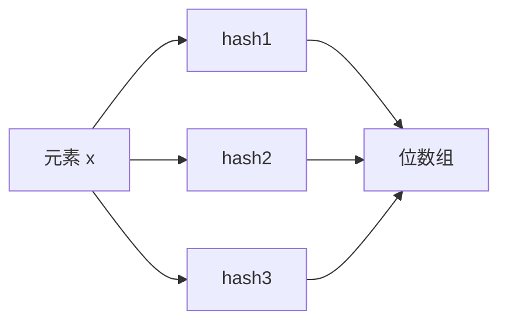
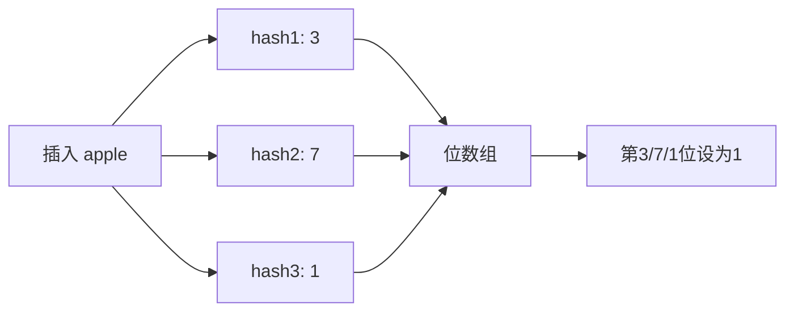
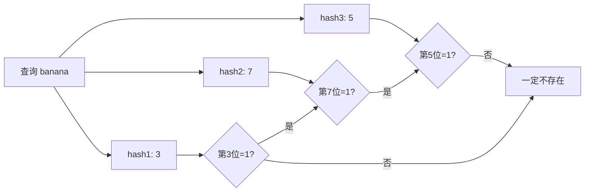
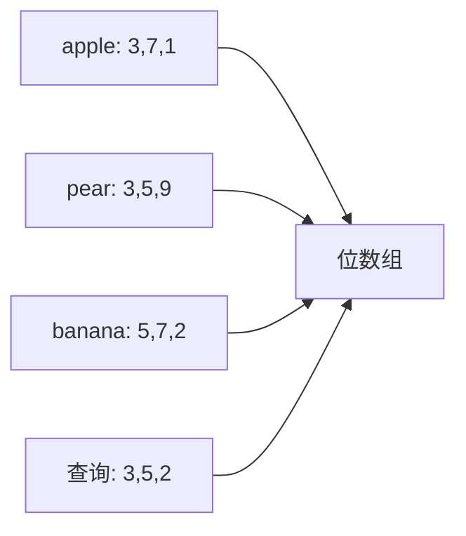
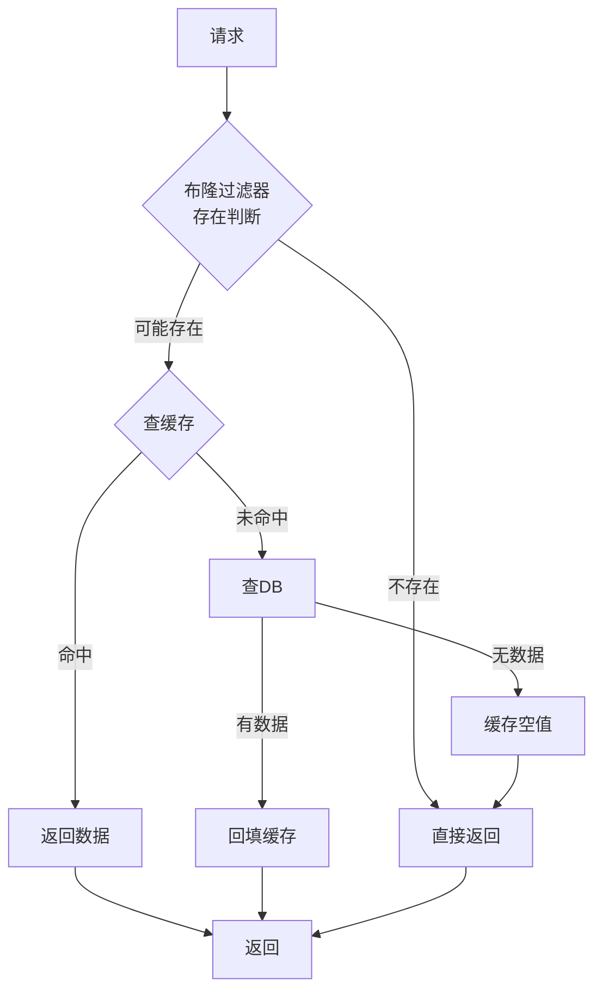

# Bloom Filter

布隆过滤器是一种**空间效率极高的概率型数据结构**，用于判断一个元素**是否可能存在**于集合中。

<!-- more -->

## 1. 核心问题

快速判断一个元素是否存在于海量数据中：

| 问题 | 传统方案 | Bloom Filter |
|------|---------|-------------|
| 存储空间 | O(n) 存原始数据 | O(n/k) 位数组 |
| 查询时间 | O(n) 遍历 / O(1) 哈希 | O(k) 多个哈希 |
| 误判率 | 0% | 可控制在 0.1%~1% |
| 能否删除 | 支持 | 不支持 |

!!! success "核心优势"
    - **空间节省**：比存原始数据省几十倍内存<br>
    - **查询极快**：O(k)，k=哈希函数个数，通常 3~5 个<br>
    - **不会漏判**：说不存在就一定不存在

!!! danger "核心劣势"
    - **会误判**：说存在可能不存在（可控制误判率）<br>
    - **无法删除**：只增不减，删除会破坏数据

## 2. 工作原理

### 2.1 数据结构



1. 一个长度为 `m` 的**位数组**，初始全为 0
2. 有 `k` 个**哈希函数**，每个函数映射到一个数组位置

### 2.2 插入过程

插入元素 `x`：



```python
def add(item):
    for seed in range(k):
        index = hash(item, seed) % m
        bit_array[index] = 1
```

### 2.3 查询过程

查询元素 `y` 是否存在：



```python
def might_contain(item):
    for seed in range(k):
        index = hash(item, seed) % m
        if bit_array[index] == 0:
            return False  # 一定不存在
    return True  # 可能存在
```

### 2.4 最小实现

```python
class BloomFilter:
    """最小实现：3个哈希函数 + 位数组"""

    def __init__(self, size=16):
        self.size = size
        self.bit_array = [0] * size          # 位数组

    def _hashes(self, item):
        """3个哈希函数，返回3个位置"""
        h1 = hash(item) % self.size          # 直接用 Python 内置 hash
        h2 = hash(item + "salt1") % self.size # 加盐改变位置
        h3 = hash(item + "salt2") % self.size
        return [h1, h2, h3]

    def add(self, item):
        """插入元素"""
        for idx in self._hashes(item):
            self.bit_array[idx] = 1

    def might_contain(self, item):
        """查询元素：所有位置都为1才可能存在"""
        return all(self.bit_array[idx] == 1 for idx in self._hashes(item))

# 使用
bf = BloomFilter(16)
bf.add("apple")
bf.add("pear")

print(bf.might_contain("apple"))  # True
print(bf.might_contain("grape"))  # False (可能误判为 True)
```

### 2.5 为什么会误判？

多个不同的元素可能映射到相同的位置：



查询 "grape" 时，第 3、5、2 位都为 1，但 "grape" 从未插入过——**误判**。

## 3. 数学推导

### 3.1 误判率公式

设位数组大小为 `m`，元素个数为 `n`，哈希函数个数为 `k`：

$$
P_{fp} = (1 - e^{-kn/m})^k
$$

### 3.2 最优哈希函数个数

$$
k = \frac{m}{n} \ln 2
$$

### 3.3 典型误判率

| 位数组/元素 | n=10万 | n=100万 | n=1000万 |
|------------|--------|---------|----------|
| 10 bit/元素 | ~1% | ~10% | ~50% |
| 23 bit/元素 | ~0.1% | ~1% | ~10% |

!!! tip "经验公式"
    布隆过滤器的空间占用主要取决于**期望的误判率**，而非元素本身的大小。

## 4. 代码实现

### 4.1 Guava 实现（Java）

```java
import com.google.common.hash.BloomFilter;
import com.google.common.hash.Funnels;

public class BloomFilterExample {

    // 创建布隆过滤器
    BloomFilter<Long> filter = BloomFilter.create(
        Funnels.longFunnel(),
        1000_000,    // 预期插入数量
        0.01          // 误判率 1%
    );

    // 插入
    public void add(Long id) {
        filter.put(id);
    }

    // 查询
    public boolean mightContain(Long id) {
        return filter.mightContain(id);
    }
}
```

### 4.2 Redis 实现（RedisBloom）

```bash
# 添加元素
BF.ADD product:bloom 1001

# 查询元素
BF.EXISTS product:bloom 1001

# 批量添加
BF.MADD product:bloom 1002 1003 1004

# 批量查询
BF.MEXISTS product:bloom 1001 1002 9999
```

```java
// Jedis 使用
jedis.bf().add("product:bloom", 1001L);
Boolean exists = jedis.bf().exists("product:bloom", 1001L);
```

### 4.3 Python 实现

```python
from bitarray import bitarray
import mmh3  # MurmurHash3

class BloomFilter:
    def __init__(self, size, hash_count):
        self.size = size
        self.hash_count = hash_count
        self.bit_array = bitarray(size)
        self.bit_array.setall(0)

    def add(self, item):
        for seed in range(self.hash_count):
            index = mmh3.hash(str(item), seed) % self.size
            self.bit_array[index] = 1

    def might_contain(self, item):
        for seed in range(self.hash_count):
            index = mmh3.hash(str(item), seed) % self.size
            if self.bit_array[index] == 0:
                return False
        return True
```

## 5. 应用场景

### 5.1 缓存穿透防护



```java
@Service
public class ProductService {

    @Autowired
    private BloomFilter<Long> productFilter;

    @Cacheable(value = "product", key = "#id")
    public Product getProduct(Long id) {
        // 布隆过滤器判断在 2.4 节防穿透中讲解
        return productMapper.selectById(id);
    }
}
```

### 5.2 爬虫 URL 去重

```java
public class Crawler {

    private BloomFilter<String> visitedFilter = BloomFilter.create(
        Funnels.stringFunnel(StandardCharsets.UTF_8),
        10_000_000,
        0.001
    );

    public void crawl(String url) {
        if (visitedFilter.mightContain(url)) {
            // 可能已访问，跳过或继续
            return;
        }

        // 抓取页面
        fetchAndProcess(url);

        // 标记已访问
        visitedFilter.put(url);
    }
}
```

### 5.3 邮箱垃圾过滤

```java
BloomFilter<String> spamFilter = BloomFilter.create(
    Funnels.stringFunnel(StandardCharsets.UTF_8),
    1_000_000,
    0.001
);

// 加载垃圾邮箱黑名单
spamFilter.put("spam1@example.com");
spamFilter.put("spam2@example.com");

// 判断
if (spamFilter.mightContain(email)) {
    // 可能垃圾邮件，进一步检查
} else {
    // 正常邮件
}
```

## 6. 变种与扩展

### 6.1 Counting Bloom Filter

支持删除的变种，位数组扩展为计数器数组：


```java
// Redis 实现
BF.ADD → CF.ADD    // 添加
BF.EXISTS → CF.EXISTS  // 查询
CF.DEL → 删除计数
```

### 6.2 Scalable Bloom Filter

可动态扩展的布隆过滤器：

```java
// Guava 实现
funnel = Funnels.stringFunnel(StandardCharsets.UTF_8);
filter = ScalableBloomFilter.create(funnel, 1000, 0.01);
```

### 6.3 Cuckoo Filter

比 Bloom Filter 更高的空间效率，支持删除，误判率相近：

| 对比 | Bloom Filter | Cuckoo Filter |
|------|-------------|---------------|
| 空间 | 1 | ~0.5（相同误判率） |
| 删除 | ❌ | ✅ |
| 插入性能 | O(k) | O(1) 均摊 |
| 查询性能 | O(k) | O(1) |

## 7. 注意事项

!!! warning "重要提醒"
    1. **提前规划容量**：元素数量超过预期会大幅增加误判率<br>
    2. **不支持删除**：需要删除用 Counting Bloom Filter 或 Cuckoo Filter<br>
    3. **不可清空**：只能重建，无法像 Redis 一样 FLUSHDB<br>
    4. **数据无法还原**：只能判断存在性，无法取出原始数据

### 7.1 容量规划公式

预估所需位数：

$$
m = -\frac{n \ln P}{(\ln 2)^2}
$$

```python
import math

def calc_size(n, p):
    """
    n: 预期元素数量
    p: 期望误判率
    返回: 需要的位数
    """
    m = -(n * math.log(p)) / (math.log(2) ** 2)
    return int(math.ceil(m))

def calc_hash_count(m, n):
    """
    返回: 最优哈希函数个数
    """
    return int(round((m / n) * math.log(2)))
```

## 8. 总结

| 特性 | 说明 |
|------|------|
| **时间复杂度** | O(k)，k=哈希函数个数 |
| **空间复杂度** | O(m)，m=位数组大小 |
| **误判率** | 可控制，通常 0.1%~1% |
| **不会漏判** | 不存在 → 一定不存在 |
| **不支持删除** | 只增不减 |

!!! success "一句话总结"
    布隆过滤器用**少量空间**换取**极快查询**，代价是**可控的误判率**，核心价值在于"**说不存在就一定不存在**"这个特性。