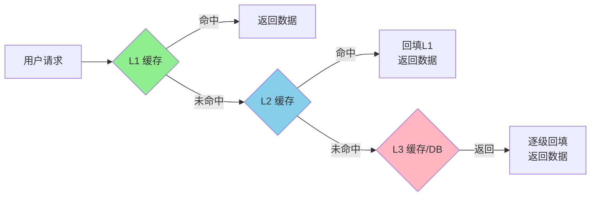
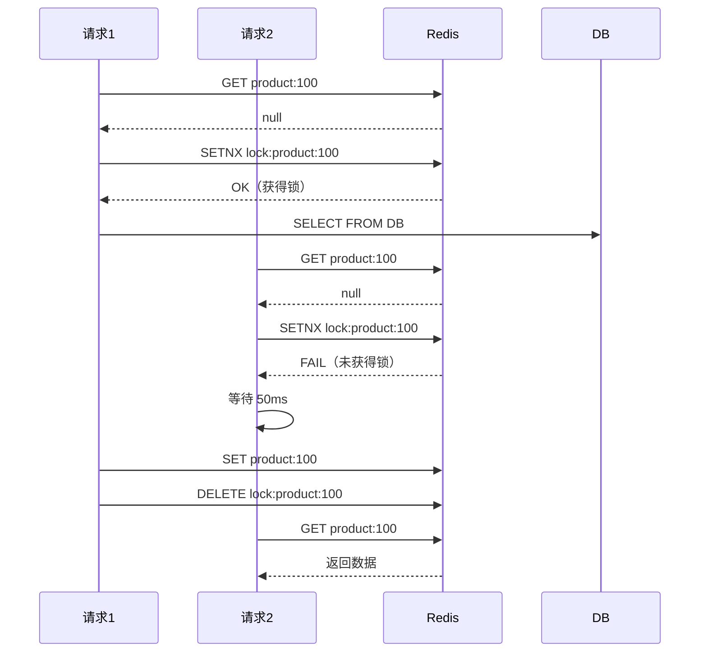
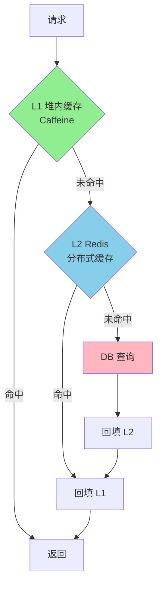
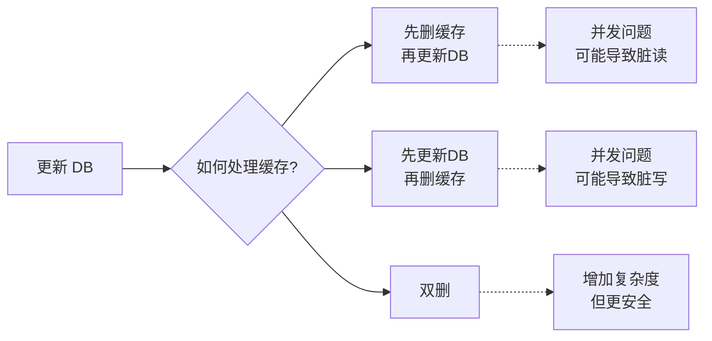

# Cache Design

多级缓存是后端系统中提升性能的核心技术，通过在不同层级设置缓存来减少数据库压力、降低访问延迟。本文介绍多级缓存的架构设计及缓存一致性问题。



<!-- more -->

## 1. 多级缓存概述

| 缓存级别 | 典型实现 | 访问延迟 | 存储容量 | 成本 |
|:--------:|---------|---------|---------|------|
| **L1** | JVM 堆内 / Caffeine | ~1 ns | MB 级别 | 极低 |
| **L2** | JVM 堆外 / Redis 单机 | ~100 μs | GB 级别 | 低 |
| **L3** | Redis 集群 / Memcached | ~1 ms | TB 级别 | 中高 |
| **DB** | MySQL / PostgreSQL | ~10 ms | 无上限 | — |

!!! tip "核心收益"
    - 减少数据库 QPS：热点数据在缓存层即可命中<br>
    - 降低访问延迟：L1 命中时延迟可降至纳秒级<br>
    - 提高系统吞吐量：缓存承接主要读请求

### 1.1 缓存分级策略

| 策略 | 适用场景 | 说明 |
|------|---------|------|
| **读多写少** | 商品详情、用户信息 | 以读为主，一致性要求不高 |
| **写多读少** | 计数器、排行榜 | 先写缓存，定期落盘 |
| **写后读** | Session、会话 | 写操作后立即读取 |
| **写直达** | 关键数据 | CacheAside + 双写 |

## 2. 一级缓存（本地缓存）

一级缓存是 **进程内缓存**，位于应用服务器的 JVM 堆内存中，访问速度最快。

| 特性 | 说明 |
|------|------|
| **位置** | 应用进程内（JVM 堆） |
| **延迟** | ~1 ns（内存级别） |
| **容量** | 通常 MB 级别 |
| **共享** | 单节点内多线程共享 |
| **失效** | 进程重启即丢失 |

### 2.1 常见实现

=== "Caffeine"

    高性能 Java 缓存库，Guava Cache 的增强版：

    ```java
    LoadingCache<Long, User> cache = Caffeine.newBuilder()
        .maximumSize(10_000)           // 最大条目数
        .expireAfterWrite(10, TimeUnit.MINUTES)  // 写后过期
        .recordStats()                 // 记录统计
        .build(key -> loadUser(key));  // 自动加载

    User user = cache.get(userId);
    ```

    | 参数 | 说明 | 使用场景 |
    |------|------|---------|
    | `maximumSize` | 最大条目数，超过后按淘汰策略清理 | 防止内存溢出 |
    | `maximumWeight` | 最大权重，重量级条目会被优先淘汰 | 按数据大小控制缓存 |
    | `expireAfterWrite` | 数据写入后多久过期 | 数据一致性要求不高 |
    | `expireAfterAccess` | 最后一次访问后多久过期 | 限制缓存存活时间 |
    | `refreshAfterWrite` | 数据写入后多久异步刷新（返回旧值） | 解决缓存击穿、保持热点 |

    !!! tip "expireAfterWrite vs refreshAfterWrite"
        **expireAfterWrite**：过期后直接删除，下次访问会阻塞等待加载<br>
        **refreshAfterWrite**：过期后异步刷新，**立即返回旧值**，用户体验更好<br>
        <br>
        **场景选择**：<br>
        - 缓存击穿问题：用 `refreshAfterWrite`，始终有值可返回<br>
        - 缓存穿透问题：用 `expireAfterWrite` + 异步加载，null 值也会被缓存<br>
        - 数据一致性要求高：用 `expireAfterWrite` 定期过期 + 主动删除

=== "Guava Cache"

    Google Guava 提供的线程安全缓存：

    ```java
    Cache<Long, User> cache = CacheBuilder.newBuilder()
        .maximumSize(10_000)
        .expireAfterWrite(10, TimeUnit.MINUTES)
        .removalListener(notification -> {
            System.out.println("移除原因: " + notification.getCause());
        })
        .build();

    User user = cache.getIfPresent(userId);
    ```

=== "Caffeine 与 Guava 对比"

    | 特性 | Caffeine | Guava |
    |------|---------|-------|
    | 性能 | 更高（优化更好） | 较高 |
    | API | 更丰富 | 基础 |
    | 刷新机制 | 支持异步 refresh | 需要自行实现 |
    | 淘汰算法 | W-TinyLFU | LRU/LFU |

### 2.2 使用场景

!!! success "适合使用 L1 缓存"
    - 热点数据访问（访问频率极高）<br>
    - 数据变更不频繁（静态配置、字典表）<br>
    - 对一致性要求不高（允许短暂数据不一致）<br>
    - 微服务架构中的单机场景

!!! warning "不适合使用 L1 缓存"
    - 分布式场景（多节点无法同步）<br>
    - 数据频繁变更（缓存失效快）<br>
    - 大数据量（超出 JVM 堆内存）

### 2.3 实战：防止缓存击穿

```java
LoadingCache<Long, Product> cache = Caffeine.newBuilder()
    .maximumSize(10_000)
    .refreshAfterWrite(1, TimeUnit.MINUTES)  // 关键：过期前异步刷新
    .build(key -> loadFromDB(key));           // 返回旧值同时后台加载

// 请求时：若已过期，立即返回旧值，后台异步加载新数据
Product product = cache.get(productId);
```

!!! tip "工作原理"
    - 当 key 过期时，下一个请求**立即返回旧值**<br>
    - 同时后台异步加载新数据填回缓存<br>
    - 后续请求获取到新值<br>
    - **效果**：永不等锁，永不阻塞

### 2.4 实战：防止缓存穿透

**方式一：手动缓存空值**

```java
LoadingCache<Long, Product> cache = Caffeine.newBuilder()
    .maximumSize(10_000)
    .expireAfterWrite(5, TimeUnit.MINUTES)
    .build(key -> {
        Product product = getProductFromDB(key);
        if (product == null) {
            // 关键：缓存空值，防止穿透
            return Product.EMPTY;
        }
        return product;
    });

// 查询时
Product product = cache.get(productId);
if (product == Product.EMPTY) {
    return null;  // 确实不存在
}
```

**方式二：Spring Cache 注解（推荐）**

Spring Cache 默认会缓存空值，无需手动处理 `null`：

```java
@Service
public class ProductService {

    @Cacheable(value = "product", key = "#id")
    public Product getProduct(Long id) {
        return productMapper.selectById(id);  // 返回 null 也会被缓存
    }
}
```

| 注解配置 | 说明 |
|---------|------|
| `cacheNullValues = true` | 缓存空值（默认） |
| `cacheNullValues = false` | 不缓存空值 |
| `unless = "#result == null"` | 条件判断，不缓存 null |

!!! warning "空值缓存的问题"
    - 空值也会占用缓存空间，TTL 不宜过长<br>
    - 如果恶意请求的 key 太多，仍会撑爆缓存<br>
    这种情况下建议用**布隆过滤器**[^1]

[^1]: 详见 [BloomFilter](/cs-basics/2026/05/16/bloom-filter/)

## 3. 二级缓存（分布式缓存）

二级缓存是 **跨进程共享的缓存**，通常部署为独立服务，供多个应用节点访问。

| 特性 | 说明 |
|------|------|
| **位置** | 独立缓存服务（Redis/Memcached） |
| **延迟** | ~100 μs ~ 1 ms |
| **容量** | GB ~ TB 级别 |
| **共享** | 多节点共享 |
| **失效** | 服务重启后丢失 |

### 3.1 缓存模式

| 模式 | 描述 | 优点 | 缺点 |
|------|------|------|------|
| **CacheAside** | 先读缓存，缓存miss时查DB并写入缓存 | 简单、常用 | 首访有延迟 |
| **ReadThrough** | 缓存自动加载，对应用透明 | 简化代码 | 实现复杂 |
| **WriteThrough** | 写缓存时同步写DB | 数据一致 | 写入延迟 |
| **WriteBehind** | 异步写DB，批量合并 | 写入性能高 | 可能丢数据 |

=== "CacheAside（旁路缓存）"

    **读操作**：

    ```mermaid
    sequenceDiagram
        Client->>Cache: 读 key
        Cache-->>Client: 命中返回
        Cache->>DB: 未命中，查 DB
        DB-->>Cache: 返回数据
        Cache->>Client: 返回数据并写入缓存
    ```

    **写操作**：

    ```mermaid
    sequenceDiagram
        Client->>DB: 写数据
        DB-->>Client: 写入成功
        Client->>Cache: 删除 key（不是更新）
    ```

    !!! tip "为什么删除而不是更新？"
        删除缓存可以避免并发更新导致的**脏数据**<br>
        假设两个并发写操作：<br>
        - 线程A更新 DB 为 v1<br>
        - 线程B更新 DB 为 v2<br>
        - 线程A更新缓存为 v1<br>
        - 线程B更新缓存为 v2<br>
        如果时序错误，可能导致缓存是 v1 而 DB 是 v2

=== "WriteBehind（异步写回）"

    ```mermaid
    graph LR
        A[写请求] --> B[写缓存]
        B --> C{消息队列}
        C --> D[异步消费]
        D --> E[批量写DB]
        D --> F[删除缓存]
    ```

    适用于写多读少场景，如：埋点数据、日志数据。

### 3.2 防止缓存击穿

当某个**热点 key 过期瞬间**，大量请求同时击穿到 DB，造成数据库压力激增。

#### 方案一：SETNX 单飞模式

```java
public Product getProduct(Long productId) {
    String key = "product:" + productId;
    String lockKey = "lock:" + key;

    // 1. 先查缓存
    Product product = redisTemplate.opsForValue().get(key);
    if (product != null) {
        return product;
    }

    // 2. 尝试获取锁（只有一个请求能成功）
    Boolean acquired = stringRedisTemplate.opsForValue()
        .setIfAbsent(lockKey, "1", 10, TimeUnit.SECONDS);

    if (Boolean.TRUE.equals(acquired)) {
        try {
            // 获得锁的请求：查 DB 并写入缓存
            product = productMapper.selectById(productId);
            if (product != null) {
                redisTemplate.opsForValue().set(key, product, 10, TimeUnit.MINUTES);
            }
        } finally {
            redisTemplate.delete(lockKey);  // 释放锁
        }
    } else {
        // 没拿到锁：等待后重试
        try {
            Thread.sleep(50);
        } catch (InterruptedException e) {
            Thread.currentThread().interrupt();
        }
        // 等待后再次尝试从缓存获取
        product = redisTemplate.opsForValue().get(key);
    }

    return product;
}
```



| 对比 | SETNX 单飞 | Caffeine refreshAfterWrite |
|------|-----------|---------------------------|
| **等待机制** | 未获锁请求需要阻塞等待 | 始终返回旧值，不阻塞 |
| **复杂度** | 高（锁 + 等待 + 重试） | 低（自动异步刷新） |
| **一致性** | 好（始终返回最新数据） | 弱（返回旧值） |
| **适用场景** | 分布式环境、多进程 | 单机 JVM |

!!! tip "SETNX 单飞 vs 分布式锁"
    两者核心都是 `SETNX + TTL`，但目的不同：<br>
    - **分布式锁**：保护互斥资源，确保同一时刻只有一个进程执行<br>
    - **SETNX 单飞**：协调多个请求，让"获锁者"加载数据，其他请求"等"并重试<br>
    <br>
    分布式锁的 TTL 要足够长（覆盖业务操作），单飞模式的锁 TTL 要足够短（只是"加载信号"）

#### 方案二：逻辑过期

不给 key 设置真正过期时间，而是在 value 中存储"逻辑过期时间"，查到数据时判断是否过期：

```java
public Product getProduct(Long productId) {
    String key = "product:" + productId;
    String json = redisTemplate.opsForValue().get(key);

    if (json != null) {
        ProductCache cache = JSON.parseObject(json, ProductCache.class);

        // 判断是否逻辑过期
        if (System.currentTimeMillis() < cache.getExpireTime()) {
            return cache.getProduct();  // 未过期，直接返回
        }
    }

    // 逻辑过期：尝试获取锁加载新数据
    String lockKey = "lock:" + key;
    Boolean acquired = stringRedisTemplate.opsForValue()
        .setIfAbsent(lockKey, "1", 10, TimeUnit.SECONDS);

    if (Boolean.TRUE.equals(acquired)) {
        try {
            Product product = productMapper.selectById(productId);
            // 写入时设置逻辑过期时间（如：当前时间 + 1分钟）
            ProductCache newCache = new ProductCache(product, System.currentTimeMillis() + 60_000);
            redisTemplate.opsForValue().set(key, JSON.toJSONString(newCache), 30, TimeUnit.MINUTES);
            return product;
        } finally {
            redisTemplate.delete(lockKey);
        }
    }

    // 没获锁：返回旧数据（可能已过期）
    return cache != null ? cache.getProduct() : null;
}
```

```json
// Redis 存储结构
{
  "product": {...},
  "expireTime": 1715840000000  // 逻辑过期时间戳
}
```

| 方案 | 优点 | 缺点 |
|------|------|------|
| **SETNX 单飞** | 数据始终最新 | 请求需要等待锁 |
| **逻辑过期** | 不阻塞，直接返回旧数据 | 可能返回过期数据 |
| **Caffeine refreshAfterWrite** | 自动异步刷新，对应用透明 | 仅限单机 JVM |

!!! warning "SETNX 单飞的潜在问题"
    如果获锁请求加载失败（DB 故障），其他请求会一直等待重试。<br>
    解决：设置最大重试次数，超过后降级到直接查 DB：<br>
    ```java
    for (int i = 0; i < 3; i++) {
        Product product = redisTemplate.opsForValue().get(key);
        if (product != null) return product;
        // ... 获锁失败，等待重试
    }
    return productMapper.selectById(productId);  // 降级查 DB
    ```

## 4. 三级缓存（多级缓存架构）

三级缓存并不是一个新的缓存层，而是 **L1 + L2 的组合架构**，充分发挥各级缓存的优势。



### 4.1 多级缓存优势

| 优势 | 说明 |
|------|------|
| **分层抗压** | L1 抗住 90%+ 热点访问 |
| **降低网络开销** | 减少 Redis 网络调用 |
| **提高可用性** | L1 仍可服务（Redis 故障时） |
| **一致性分级** | 不同数据不同策略 |

### 4.2 实现方案

```java
@Service
public class MultiLevelCacheService {

    // L1: 本地缓存 (Caffeine)
    private final LoadingCache<Long, Product> l1Cache = Caffeine.newBuilder()
        .maximumSize(10_000)
        .expireAfterWrite(1, TimeUnit.MINUTES)
        .build(key -> null);  // L1 不负责加载

    // L2: 分布式缓存 (Redis)
    @Autowired
    private RedisTemplate<String, Product> redisTemplate;

    public Product getProduct(Long productId) {
        // 1. 查询 L1
        Product product = l1Cache.getIfPresent(productId);
        if (product != null && product != Product.EMPTY) {
            return product;
        }

        // 2. 查询 L2
        String key = "product:" + productId;
        product = redisTemplate.opsForValue().get(key);
        if (product != null) {
            // 回填 L1
            l1Cache.put(productId, product);
            return product;
        }

        // 3. 查询 DB
        product = productMapper.selectById(productId);
        if (product != null) {
            // 回填 L2 和 L1
            redisTemplate.opsForValue().set(key, product, 10, TimeUnit.MINUTES);
            l1Cache.put(productId, product);
        } else {
            // 防止缓存击穿：写入空对象
            l1Cache.put(productId, Product.EMPTY);
        }

        return product;
    }
}
```

### 4.3 缓存过期策略

| 策略 | 说明 | 适用场景 |
|------|------|---------|
| **L1 短 + L2 长** | 本地缓存快速失效，Redis 保留更久 | 数据变更频繁 |
| **L1 长 + L2 短** | 本地缓存保留更久 | 数据相对稳定 |
| **异步刷新** | L1 后台线程主动刷新 | 准实时场景 |

!!! warning "L1 缓存更新难题"
    当 L2 数据更新时，L1 数据如何失效？<br>
    方案一：缩短 L1 TTL（如 1 分钟）<br>
    方案二：使用 Redis Pub/Sub 通知<br>
    方案三：直接禁用 L1（不推荐）<br>
    这就是下一节要讨论的**缓存一致性**问题

## 5. 缓存一致性

### 5.1 问题根源



### 5.2 CacheAside 模式的问题

!!! danger "并发导致的数据不一致"

    **时序问题场景**：

    1. 线程A 读取数据 → Cache Miss → 查询 DB → 返回 v1
    2. 线程B 更新数据 → 更新 DB 为 v2 → 删除缓存
    3. 线程A 将 v1 写入缓存
    4. **结果**：缓存中是 v1，DB 中是 v2

    **解决方案**：延迟双删

    ```java
    // 1. 先删除缓存
    redisTemplate.delete("product:100");

    // 2. 更新数据库
    productMapper.update(product);

    // 3. 延迟一段时间后再次删除缓存（异步）
    CompletableFuture.runAsync(() -> {
        try {
            Thread.sleep(500);  // 延迟 500ms
            redisTemplate.delete("product:100");
        } catch (InterruptedException e) {
            Thread.currentThread().interrupt();
        }
    });
    ```

### 5.3 解决方案汇总

| 方案 | 原理 | 一致性 | 性能 | 复杂度 |
|------|------|-------|------|-------|
| **延迟双删** | 双重删除 | 强 | 中 | 低 |
| **订阅 binlog** | 监听 DB 变更 | 强 | 高 | 高 |
| **Cannal 中间件** | 解析 binlog | 强 | 高 | 中 |
| **直接禁用缓存** | 只读不写缓存 | 强 | 低 | 最低 |

=== "延迟双删"

    ```java
    public void updateProduct(Product product) {
        Long productId = product.getId();

        // 步骤1：删除缓存
        redisTemplate.delete("product:" + productId);

        // 步骤2：更新数据库
        productMapper.updateById(product);

        // 步骤3：延迟再次删除缓存
        redisTemplate.execute((RedisCallback<?>) connection -> {
            Thread.sleep(500);
            return null;
        });
        redisTemplate.delete("product:" + productId);
    }
    ```

=== "订阅 Binlog"

    ```java
    @KafkaListener(topics = "product_update")
    public void onProductUpdate(ProductEvent event) {
        if (event.getOperation() == Operation.UPDATE) {
            redisTemplate.delete("product:" + event.getProductId());
        }
    }
    ```

    ```mermaid
    graph LR
        A[MySQL] --> B[Canal]
        B --> C[消息队列]
        C --> D[消费服务]
        D --> E[删除 Redis 缓存]
    ```

### 5.4 缓存与数据库的更新顺序

| 操作顺序 | 问题 | 解决方案 |
|---------|------|---------|
| 先删缓存，再更新 DB | 并发时旧数据被写回缓存 | 延迟双删 |
| 先更新 DB，再删缓存 | 可能短暂出现缓存旧数据 | 可接受（最终一致） |

!!! question "哪种顺序更好？"
    推荐：**先删缓存，再更新 DB**<br>
    原因：删除缓存后，下一个读请求会发现缓存 miss，去 DB 读取新数据<br>
    即使旧数据被写入缓存，也是短暂的（下次更新时会删除）<br>
    如果顺序反过来，可能导致长时间的数据不一致

### 5.5 大Key与热Key问题

| 问题 | 表现 | 解决方案 |
|------|------|---------|
| **大Key** | 单个 Key 数据过大 | 拆分为 Hash/Set |
| **热Key** | 某个 Key 访问量过大 | 多级缓存、本地缓存 |
| **热点Key探测** | 访问集中 | 使用 Redis MONITOR 采样 |

!!! warning "热Key优化案例"
    某商品详情页，1万 QPS 打到同一个 product:10000 的 Key 上<br>
    **优化方案**：<br>
    1. 在 L1 Caffeine 中缓存该 Key（本地缓存抗热点）<br>
    2. 或者将 Key 分散：如 `product:10000:v1/v2/v3`<br>
    3. 使用 Redis Cluster 将 Key 分散到不同 Slot