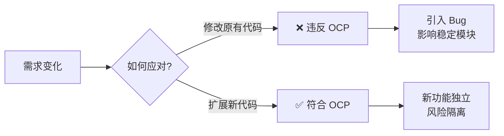
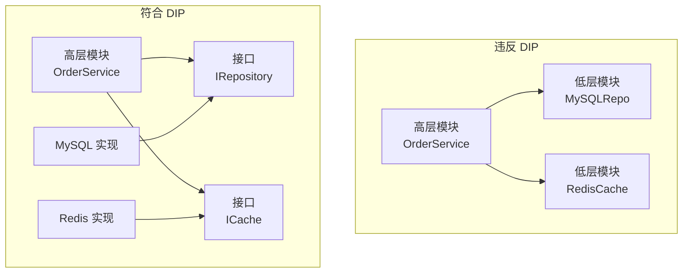
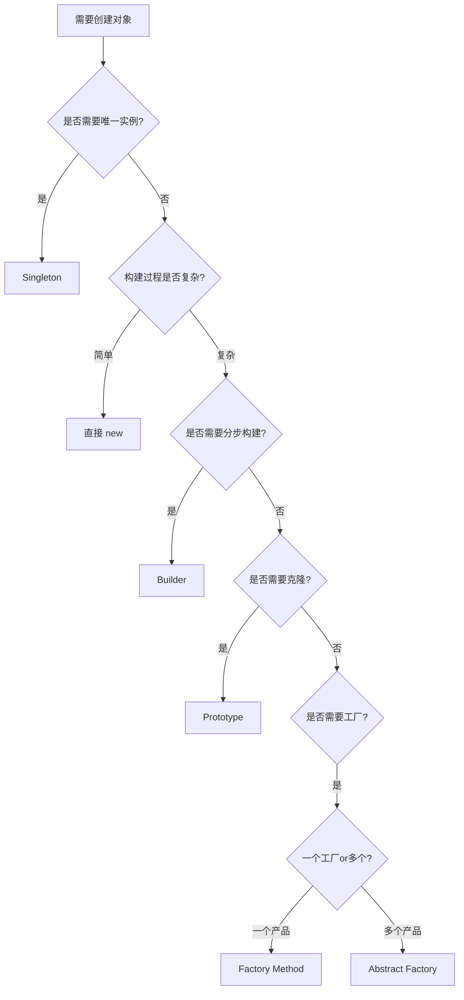
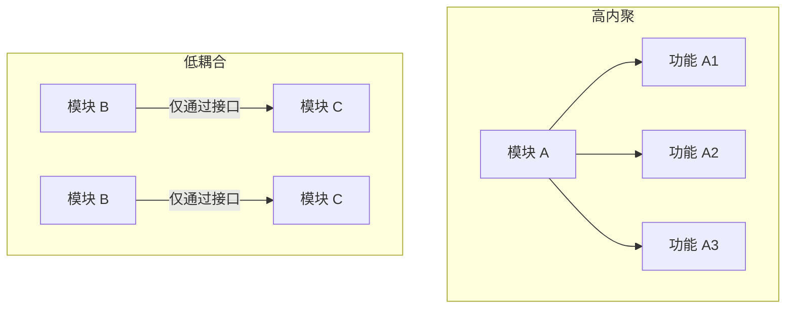

# Design Overview

设计原则与模式知识汇总，涵盖 SOLID 原则、常见设计模式及架构设计思想[^1]。

<!-- more -->

## 设计原则

### SOLID 原则

SOLID 是面向对象设计的五个基本原则[^2]：

| 原则 | 全称 | 核心思想 |
|:----:|------|---------|
| **S** | Single Responsibility Principle | 单一职责：一个类只有一个变化原因 |
| **O** | Open-Closed Principle | 开闭原则：对扩展开放，对修改封闭 |
| **L** | Liskov Substitution Principle | 里氏替换：子类必须能替换基类 |
| **I** | Interface Segregation Principle | 接口隔离：接口要小而专 |
| **D** | Dependency Inversion Principle | 依赖倒置：依赖抽象而非具体 |

!!! tip "记忆技巧"
    想象一个字母 **O** 代表"开闭原则"[^3]<br>
    **S** 像一根吸管（单一职责）<br>
    **D** 像倒置的酒杯（依赖倒置）<br>
    **I** 像分隔的格子（接口隔离）<br>
    **L** 像替换的积木（里氏替换）

### 开闭原则详解

开闭原则是 SOLID 中最核心的原则[^4]：

> "软件实体应当对扩展开放，对修改关闭" — Bertrand Meyer

???+ example "生活中的开闭原则"
    :woman: **电灯开关** 💡
    :man: 按下开关 → 灯亮/灭<br>
    :wrench: 不需要修改开关内部结构<br>
    :bulb: 只需要更换不同类型的灯泡



### 依赖倒置原则

高层模块不应该依赖低层模块，两者都应该依赖抽象[^5]。



!!! warning "常见错误"
    直接在 Service 中 `new` 一个具体实现类

```java
// ❌ 错误：高层依赖低层
private final MySQLRepository repo = new MySQLRepository();
```

应该通过构造函数注入接口：

```java
// ✅ 正确：依赖抽象
private final IRepository repo;
public OrderService(IRepository repo) { this.repo = repo; }
```

## 常见设计模式

### 创建型模式

| 模式 | 目的 | 使用场景 |
|------|------|---------|
| **Singleton** | 确保唯一实例 | 配置类、连接池 |
| **Factory Method** | 子类决定创建对象 | 日志记录器、数据库连接 |
| **Abstract Factory** | 生产一系列相关对象 | UI 主题、数据库访问 |
| **Builder** | 分步构建复杂对象 | SQL 构建器、文档生成 |
| **Prototype** | 克隆已有对象 | 复制复杂对象 |

=== "Singleton 示例"

    ```java
    public class Singleton {
        private static volatile Singleton instance;

        private Singleton() {}

        public static Singleton getInstance() {
            if (instance == null) {
                synchronized (Singleton.class) {
                    if (instance == null) {
                        instance = new Singleton();
                    }
                }
            }
            return instance;
        }
    }
    ```

    !!! tip "双重检查锁定"
        `volatile` 防止指令重排序<br>
        第一次 `null` 检查避免不必要的同步<br>
        第二次 `null` 检查确保只创建一个实例

=== "Builder 示例"

    ```java
    public class User {
        private final String name;
        private final int age;
        private final String email;

        private User(Builder builder) {
            this.name = builder.name;
            this.age = builder.age;
            this.email = builder.email;
        }

        public static class Builder {
            private String name;
            private int age;
            private String email;

            public Builder name(String name) {
                this.name = name;
                return this;
            }

            public User build() {
                return new User(this);
            }
        }
    }

    // 使用
    User user = new User.Builder()
        .name("Alice")
        .age(25)
        .build();
    ```

### 结构型模式

| 模式 | 目的 | 使用场景 |
|------|------|---------|
| **Adapter** | 接口转换 | 集成第三方库 |
| **Bridge** | 分离抽象与实现 | 跨平台应用 |
| **Composite** | 树形结构 | 组织架构、文件系统 |
| **Decorator** | 动态添加职责 | IO 流、咖啡加料 |
| **Facade** | 统一入口 | 简化复杂系统调用 |
| **Flyweight** | 共享细粒度对象 | 字符池、线程池 |
| **Proxy** | 间接访问 | 延迟加载、访问控制 |

!!! example "适配器模式：转接头"

    USB-C 转 HDMI 适配器

    :computer: USB-C 接口 → :tv: HDMI 接口

    ```mermaid
    graph LR
        A[MacBook<br>USB-C] --> B[转接头<br>Adapter]
        B --> C[显示器<br>HDMI]
    ```

### 行为型模式

| 模式 | 目的 | 使用场景 |
|------|------|---------|
| **Chain of Responsibility** | 请求链式处理 | 过滤器链、日志级别 |
| **Command** | 请求封装为对象 | 撤销/重做、任务队列 |
| **Iterator** | 统一遍历接口 | 集合遍历 |
| **Mediator** | 中介解耦对象 | UI 中间件 |
| **Memento** | 对象状态快照 | 撤销功能 |
| **Observer** | 发布-订阅 | 事件系统、监听器 |
| **State** | 状态切换 | 状态机、工作流 |
| **Strategy** | 算法策略切换 | 排序算法、支付方式 |
| **Template Method** | 骨架+钩子 | 框架设计 |
| **Visitor** | 操作与数据结构分离 | 语法树遍历 |

??? question "策略模式 vs 简单 if-else"

    **什么时候用策略模式？**

    - 算法需要经常切换 :arrows_counterclockwise:
    - 不同策略需要单独测试 :microscope:
    - 算法复用性要求高 :recycle:
    - 需要运行时动态选择 :gear:

    **简单的 if-else 何时用？**

    - 条件分支少 (≤2) :one:
    - 不会频繁变化 :closed_lock_with_key:
    - 性能敏感场景 :zap:

## 模式对比与选择

### 创建型模式选择树



### 代理模式 vs 装饰器模式

| 维度 | 代理模式 | 装饰器模式 |
|------|---------|-----------|
| **目的** | 控制访问 | 动态添加职责 |
| **实现** | 通常组合 | 通常继承 |
| **接口** | 与原对象相同 | 与原对象相同 |
| **使用** | 延迟加载、安全 | IO 流、功能增强 |

## 架构设计思想

### 高内聚低耦合



!!! success "好架构特征"
    :white_check_mark: 每个模块职责清晰<br>
    :white_check_mark: 模块间仅通过接口通信<br>
    :white_check_mark: 单一模块修改不影响其他模块<br>
    :white_check_mark: 便于单独测试

### 常见架构原则

1. **DRY (Don't Repeat Yourself)**
   - 相同的知识不要重复
   - 使用抽象复用代码

2. **KISS (Keep It Simple, Stupid)**
   - 简单设计优先
   - 避免过度工程

3. **YAGNI (You Aren't Gonna Need It)**
   - 不要提前实现不需要的功能
   - 按需演进

4. **Hollywood Principle** :movie_camera:
   - "别联系我们，我们会联系你"
   - IoC/DI 的核心思想

## 脚注

[^1]: 设计模式是软件开发中常见问题的可复用解决方案。
[^2]: SOLID 原则由 Robert C. Martin 提出，是 OOD 的基础。
[^3]: O 代表 Open-Closed Principle，是最核心的原则。
[^4]: 开闭原则最早在 Bertrand Meyer 的《面向对象软件构造》中提出。
[^5]: 依赖倒置是实现"依赖注入"和"控制反转"的基础。