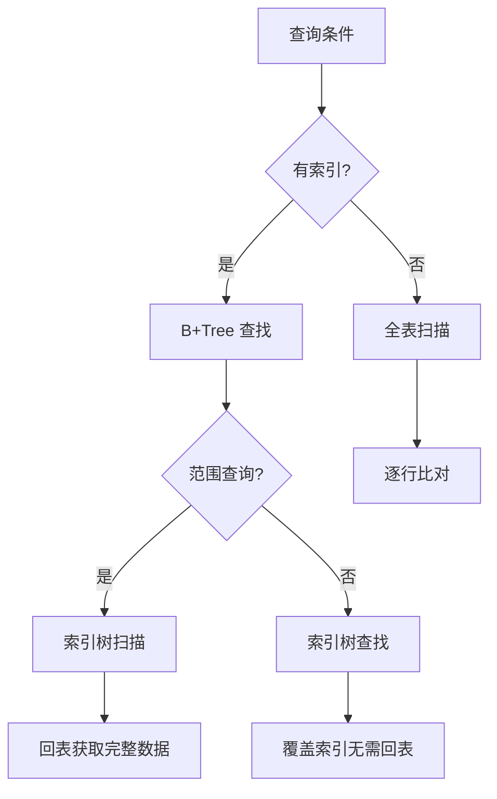
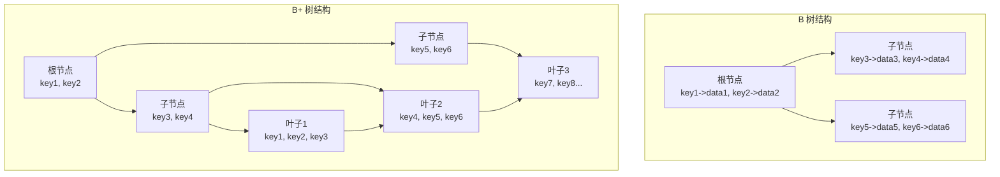
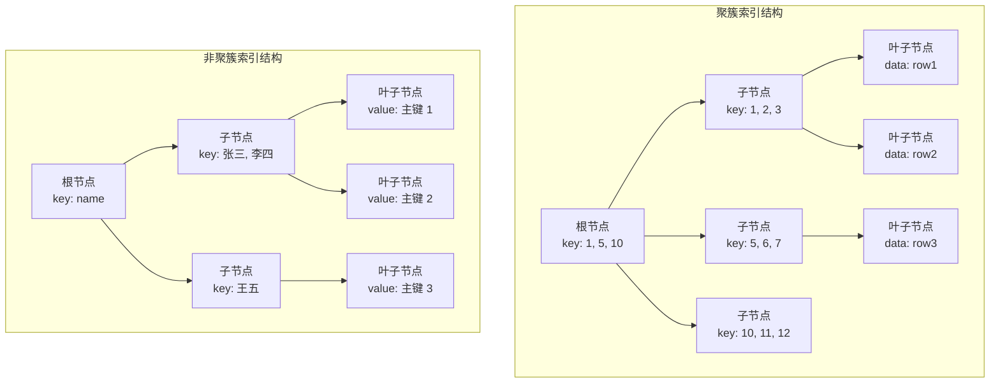
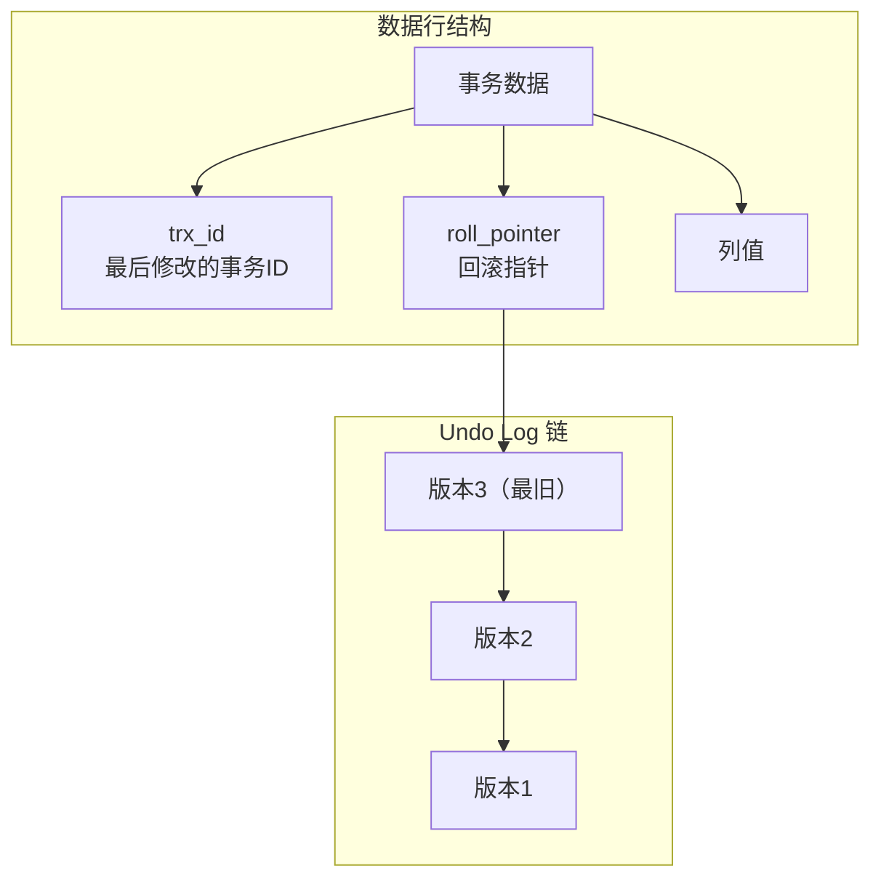
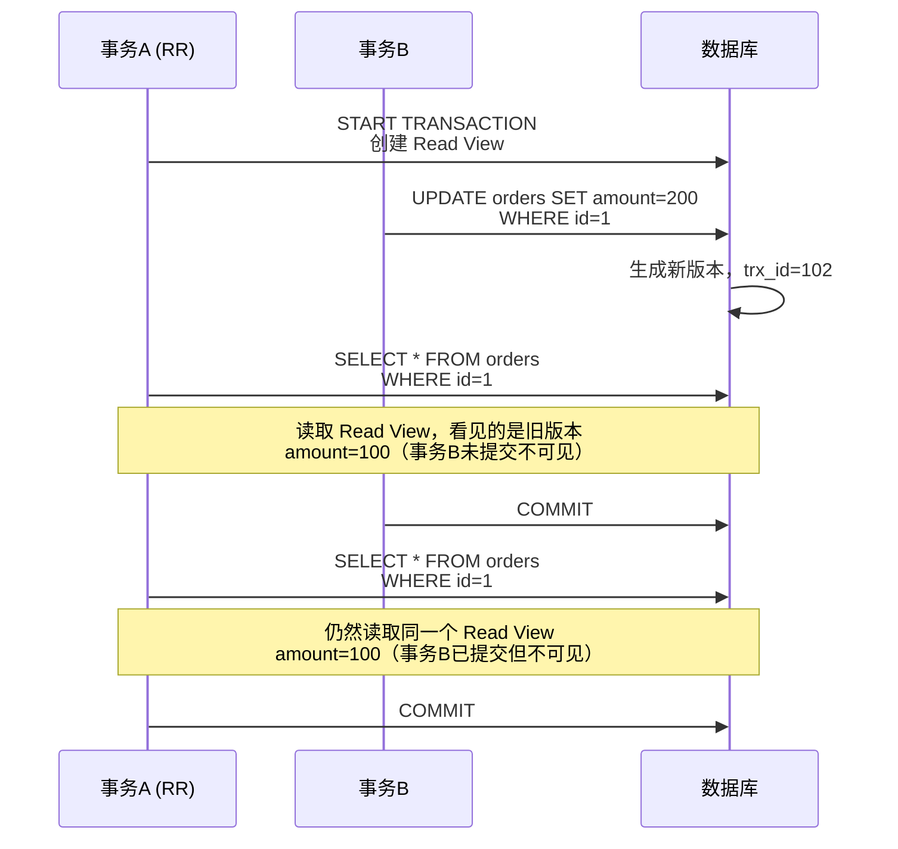
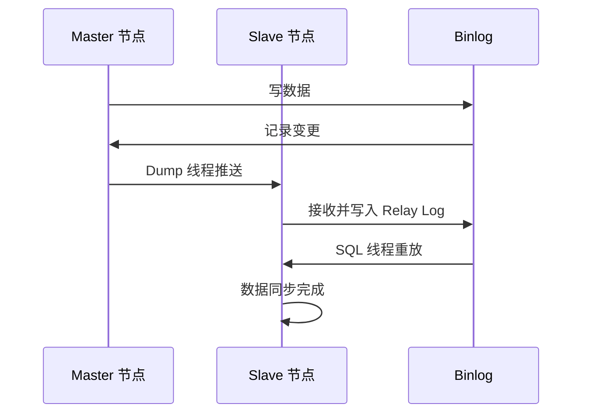
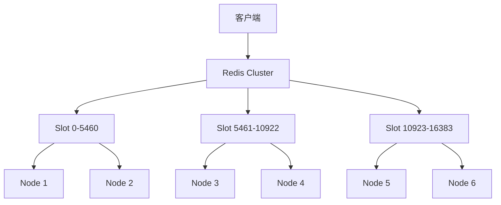
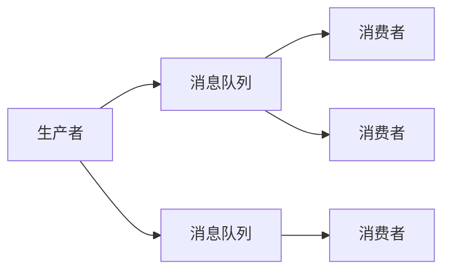
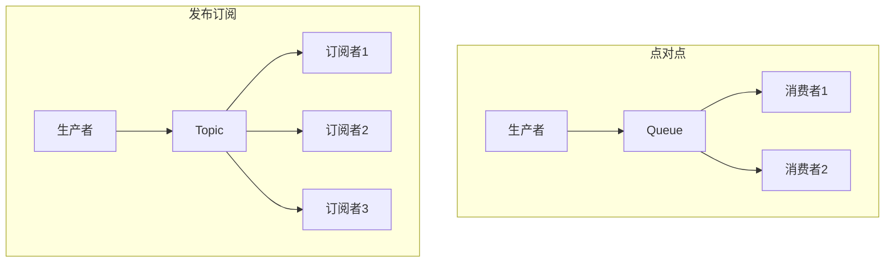

# Middleware Overview

后端开发中常用的中间件知识汇总，涵盖关系型数据库、NoSQL 缓存和消息队列三大类别。

<div style="display: flex; gap: 20px; align-items: center;">
  
  
  
</div>


<!-- more -->

## 1. MySQL 关系型数据库

MySQL 是最流行的开源关系型数据库，支持事务、索引、主从复制等特性。

### 1.1 核心特性

| 特性 | 说明 |
|------|------|
| **事务** | ACID 保障，支持 InnoDB 引擎 |
| **索引** | B+Tree 索引，覆盖索引，联合索引 |
| **锁机制** | 行级锁，表级锁，间隙锁 |
| **主从复制** | 异步复制，半同步复制 |
| **分库分表** | 水平拆分，垂直拆分 |

### 1.2 存储引擎

=== "InnoDB"

    默认存储引擎，支持事务和行级锁：
    
    === "存储引擎特性"
    
        | 特性 | 说明 |
        |------|------|
        | 事务 | 支持 ACID |
        | 行锁 | 并发性能好 |
        | 外键 | 支持外键约束 |
        | 索引 | B+Tree（聚簇索引） |
        | MVCC | 支持多版本并发控制 |
    
        ```sql
        -- 创建 InnoDB 表
        CREATE TABLE orders (
            id BIGINT PRIMARY KEY AUTO_INCREMENT,
            user_id BIGINT NOT NULL,
            amount DECIMAL(10,2) NOT NULL,
            created_at TIMESTAMP DEFAULT CURRENT_TIMESTAMP,
            INDEX idx_user_id (user_id),
            INDEX idx_created (created_at)
        ) ENGINE=InnoDB DEFAULT CHARSET=utf8mb4;
        ```
    
    === "InnoDB 内存结构"
    
        InnoDB 的内存结构主要包括缓冲池（Buffer Pool）、变更缓冲池（Change Buffer）、日志缓冲（Log Buffer）和自适应哈希索引（Adaptive Hash Index）。
    
        ```mermaid
        graph TB
            subgraph InnoDB 内存结构
                BP[Buffer Pool<br/>缓冲池]
                CIB[Change Buffer<br/>变更缓冲池]
                LB[Log Buffer<br/>日志缓冲]
                AHI[Adaptive Hash Index<br/>自适应哈希索引]
                SSA[System Struct Area<br/>系统数据结构区]
            end
    
            BP --> CIB
            BP --> AHI
            SSA --> BP
        ```
    
        ???+ example "Buffer Pool（缓冲池）"
    
            缓冲池是 InnoDB 最重要的内存区域，用于缓存表数据和索引：
    
            | 区域 | 说明 |
            |------|------|
            | **Page Frame** | 内存页框，默认 16KB/页 |
            | **Data Pages** | 缓存表数据页 |
            | **Index Pages** | 缓存索引 B+ 树节点 |
            | **Lock Info** | 锁信息 |
            | **Dictionary Info** | 数据字典信息 |
    
            !!! tip "Buffer Pool 大小设置"
                - `innodb_buffer_pool_size`：通常设置为机器内存的 50-80%
                - `innodb_buffer_pool_instances`：多个实例可提高并发
    
            ```sql
            -- 查看缓冲池状态
            SHOW ENGINE INNODB STATUS\G
            -- 或查询 performance_schema
            SELECT * FROM performance_schema.memory_summary_global_by_event_name
            WHERE EVENT_NAME LIKE '%innodb%buffer%';
            ```
    
        ???+ example "Change Buffer（变更缓冲池）"
    
            变更缓冲池用于缓存**非唯一二级索引**的变更操作，避免随机 IO：
    
            | 特性 | 说明 |
            |------|------|
            | **作用 | 缓存 INSERT/UPDATE/DELETE 对二级索引的修改 |
            | **触发时机 | 索引页不在内存时，先缓存到 Change Buffer |
            | **合并时机 | 索引页被加载到内存时，或定期合并 |
            | **配置参数 | `innodb_change_buffer_max_size`（默认 25%） |
    
            !!! warning "适用场景"
                变更缓冲只适用于**非唯一**二级索引，因为唯一索引必须验证唯一性。
    
            ```sql
            -- 查看变更缓冲使用情况
            SHOW ENGINE INNODB STATUS\G
            -- 或
            SHOW STATUS LIKE 'Innodb%buffer%';
            ```
    
        ???+ example "Log Buffer（日志缓冲）"
    
            日志缓冲用于缓存即将写入磁盘的重做日志（Redo Log）：
    
            | 配置 | 说明 |
            |------|------|
            | `innodb_log_buffer_size` | 日志缓冲大小，默认 16MB |
            | `innodb_flush_log_at_trx_commit` | 刷盘策略 |
    
            刷盘策略 `innodb_flush_log_at_trx_commit`：
    
            | 值 | 行为 | 安全性 | 性能 |
            |---|------|--------|------|
            | **1** | 每次提交同步刷盘 | 最高 | 最差 |
            | **2** | 提交时写文件缓存 | 高 | 较好 |
            | **0** | 每秒刷盘 | 低 | 最好 |
    
            ```sql
            -- 查看日志状态
            SHOW ENGINE INNODB STATUS\G
            ```
    
        ???+ example "Adaptive Hash Index（自适应哈希索引）"
    
            自适应哈希索引由 InnoDB 自动构建，用于加速等值查询：
    
            | 特性 | 说明 |
            |------|------|
            | **构建条件 | InnoDB 根据访问频率自动建立 |
            | **存储位置 | Buffer Pool 内，共享内存 |
            | **适用场景 | 等值查询（`WHERE key = ?`） |
            | **不适用 | 范围查询、模糊查询 |
    
            !!! note "AHI 是共享的"
                自适应哈希索引是实例级别共享，不是每表独立。
    
            ```sql
            -- 查看 AHI 命中情况
            SHOW ENGINE INNODB STATUS\G
            -- hash searches: 非哈希搜索次数
            -- non-hash searches: 哈希搜索次数
            ```
    
        ???+ example "System Struct Area（系统数据结构区）"
    
            包含 InnoDB 内部使用的共享数据结构：
    
            | 结构 | 说明 |
            |------|------|
            | **Page Hash** | 定位 Buffer Pool 中的缓存页 |
            | **Lock System** | 行锁和事务锁管理 |
            | **Data Dictionary** | 表结构、列信息等元数据 |
            | **Insert Buffer** | 同 Change Buffer |
            | **Rollback Segments** | 回滚段，用于 MVCC 和事务回滚 |
    
        #### 内存结构全景图
    
        ```mermaid
        graph TD
            subgraph 进程内存空间
                subgraph Buffer Pool
                    DP[Data Pages<br/>数据页]
                    IP[Index Pages<br/>索引页]
                    AHI[Adaptive Hash<br/>自适应哈希]
                    LC[Lock Control<br/>锁控制信息]
                end
    
                CIB[Change Buffer<br/>变更缓冲]
                LB[Log Buffer<br/>日志缓冲]
    
                subgraph System Struct
                    PH[Page Hash<br/>页哈希]
                    DD[Data Dictionary<br/>数据字典]
                    RS[Rollback Segments<br/>回滚段]
                end
            end
    
            LB -->|Redo Log| Disk[(磁盘<br/>Redo Log)]
            CIB -->|合并| IP
            PH -->|查找| DP
        ```

=== "MyISAM"

    早期默认引擎，不支持事务：
    
    | 特性 | 说明 |
    |------|------|
    | 事务 | 不支持 |
    | 表锁 | 全表锁定 |
    | 全文索引 | 支持 FULLTEXT |
    | 压缩 | 支持表压缩 |
    | 计数 | COUNT(*) 很快 |
    
    !!! warning "注意"
        MyISAM 不支持事务和行级锁，在高并发场景下建议使用 InnoDB。

=== "Memory"

    内存存储引擎，查询极快：
    
    | 特性 | 说明 |
    |------|------|
    | 存储 | 全存内存 |
    | 速度 | 极快 |
    | 持久性 | 重启后数据丢失 |
    | 索引 | HASH 索引 |
    
    适用于：临时表、缓存、 Session 存储。

### 1.3 索引原理



| 索引类型 | 使用场景 |
|---------|---------|
| **主键索引** | 聚簇索引，叶子节点存整行数据 |
| **唯一索引** | 约束数据唯一性 |
| **普通索引** | 加速查询 |
| **联合索引** | 多字段查询，遵循最左前缀 |
| **覆盖索引** | 无需回表，查询效率最高 |

!!! tip "最左前缀原则"
    联合索引 `(a, b, c)` 能加速以下查询：<br>
    - `WHERE a = ?`<br>
    - `WHERE a = ? AND b = ?`<br>
    - `WHERE a = ? AND b = ? AND c = ?`<br>
    - **不能**加速 `WHERE b = ?` 或 `WHERE c = ?`

#### B+ 树与 B 树的区别

| 特性 | B 树 | B+ 树 |
|------|------|-------|
| **节点存储** | key 和 data 都在节点 | 只有 key，data 都在叶子节点 |
| **叶子节点** | 无链表相连 | 有序链表，便于范围查询 |
| **查询稳定性** | 可能不等长，复杂度不稳定 | 所有查询路径长度相同 |
| **范围查询** | 需要中序遍历 | 叶子节点链表 O(1) 遍历 |
| **空间利用率** | 节点存储 data，利用率低 | 只有索引，利用率高 |
| **适用场景** | 单一查询（MongoDB） | 范围查询、顺序访问（MySQL） |



!!! tip "MySQL 为什么用 B+ 树"
    - **范围查询高效**：叶子节点链表顺序访问<br>
    - **查询稳定**：所有路径长度相同<br>
    - **空间利用率高**：非叶子节点只存索引<br>
    - **更矮更宽**：相同数据量时，B+ 树层数更少，IO 更少

!!! tip "B+ 树的层数"

    B+ 树的层数通常为 **2-4 层**，具体取决于数据量和页大小：
    
    | 因素 | 影响 |
    |------|------|
    | **页大小** | 默认 16KB，非叶子节点只存 key 和指针 |
    | **Key 大小** | 主键 bigint 约 8 字节 + 指针 6 字节 ≈ 14 字节 |
    | **单节点容量** | 16KB / 14 ≈ 1170 个索引项 |
    | **千万级数据** | 1170 × 1170 × 16 ≈ 2000 万条记录（3 层） |
    
    ```mermaid
    graph TD
        subgraph 3 层 B+ 树示例
            R[根节点<br/>~1170 个 key] --> L1[第一层节点<br/>~1170 个]
            L1 --> L2[第二层节点<br/>~1170 个]
            L1 --> L1a[...（共 1170 个）]
            L2 --> Leaf1[叶子节点<br/>数据页]
            L2 --> Leaf2[叶子节点<br/>数据页]
            L2 --> LeafN[...（共 1170² 个）]
        end
    ```
    
    !!! tip "查询效率"
        3 层 B+ 树只需 **3 次 IO**（根节点常驻内存）即可定位数据，查询非常高效。

#### 聚簇索引 vs 非聚簇索引

| 特性 | 聚簇索引（Clustered） | 非聚簇索引（Secondary） |
|------|---------------------|----------------------|
| **数据存储** | 叶子节点存储完整行数据 | 叶子节点存储主键值 |
| **一个表只能有** | 1 个（主键索引） | 多个 |
| **查询方式** | 主键查询直接返回数据 | 先查主键，再回表查数据 |
| **适用场景** | 主键查询、范围查询 | 非主键字段查询 |
| **插入性能** | 受数据物理存储顺序影响 | 插入相对独立 |
| **索引结构** | B+ 树，叶子节点是数据页 | B+ 树，叶子节点是主键值 |



??? example "InnoDB 聚簇索引（50万条数据）"

    以 50 万条数据、BigInt 主键（8 字节）为例：
    
    | 层级 | 节点数 | 说明 |
    |------|--------|------|
    | **根节点** | 1 | 约 1170 个索引项 |
    | **第一层** | ~43 | 1170 个子节点 × 50万 / (1170 × 1170) |
    | **叶子层** | ~500000 / 16 ≈ 31250 | 约 31250 个叶子节点 |
    
    ```mermaid
    graph TD
        R[根节点<br/>~1170 个 key] --> L1[第一层节点<br/>~43 个]
        L1 --> L2_1[...叶子层<br/>~31250 个数据页]
        L1 --> L2_2[...]
        L1 --> L2_N[...]
    ```
    
    !!! tip "存储计算"
        - 每个叶子节点 16KB，假设每行 100 字节 → 每页约 160 行<br>
        - 50 万行 / 160 行 ≈ 3125 个叶子节点（实际略多有碎片）<br>
        - 聚簇索引叶子节点直接存储完整行数据<br>
        - 非聚簇索引叶子节点只存储主键值（8 字节）
    
    ```sql
    -- 查看表的索引情况
    SHOW TABLE STATUS LIKE 'orders';
    
    -- 查看索引详情
    SHOW INDEX FROM orders;
    
    -- 估算大小
    SELECT
        index_name,
        table_rows,
        avg_row_length,
        (table_rows * avg_row_length) / 1024 / 1024 AS size_mb
    FROM information_schema.tables
    WHERE table_name = 'orders';
    ```

??? example "MyISAM 非聚簇索引"

    MyISAM 所有索引都是非聚簇索引，叶子节点存储的是行指针：
    
    ```sql
    CREATE TABLE orders (
        id INT PRIMARY KEY,
        name VARCHAR(50),
        INDEX idx_name (name)  -- 非聚簇索引
    );
    
    -- 索引叶子节点存储的是行指针（物理地址），而非数据本身
    -- 需要根据指针再次读取数据文件获取完整行
    ```

??? example "回表查询"

    非聚簇索引查询需要回表：
    
    ```sql
    -- 假设有联合索引 (name, age)
    SELECT * FROM users WHERE name = '张三';
    
    -- 执行过程：
    -- 1. 在索引树中找到 name='张三' 的记录
    -- 2. 获取对应的主键值（如 id=100）
    -- 3. 再用主键 id=100 去聚簇索引查找完整行数据  -- 回表
    -- 4. 返回完整数据
    
    -- 使用覆盖索引优化，无需回表
    SELECT name, age FROM users WHERE name = '张三';  -- 覆盖索引
    ```

!!! tip "选择建议"
    - **主键使用自增 ID**：避免 B+ 树频繁分裂<br>
    - **避免随机主键**：如 UUID，导致插入性能下降<br>
    - **覆盖索引**：尽量让查询只访问索引，无需回表

#### 索引失效场景

以下常见场景会导致索引无法被正常使用：

| 场景 | 说明 | 示例 |
|------|------|------|
| **函数/运算** | 索引列参与计算或函数运算 | `WHERE YEAR(date) = 2026` |
| **类型转换** | 隐式类型转换导致索引失效 | `WHERE phone = 13800138000`（phone 为 VARCHAR） |
| **最左前缀** | 跳跃或缺少联合索引的首列 | `WHERE b = ?`（联合索引为 `(a,b,c)`） |
| **范围右移** | 范围查询后的列无法使用索引 | `WHERE a = ? AND b > ? AND c = ?` |
| **LIKE 百分号** | LIKE 前置百分号无法使用索引 | `WHERE name LIKE '%三'` |
| **IS NULL** | MyISAM 允许 NULL，InnoDB 需注意 | `WHERE age IS NULL` |
| **NOT 条件** | NOT、<>、!= 通常无法使用索引 | `WHERE status != 1` |
| **OR 混用** | OR 条件中存在非索引列 | `WHERE a = ? OR b = ?`（b 无索引） |
| **统计信息** | 表数据量过小或统计信息不准确 | 全表扫描更快 |

??? example "函数/运算导致索引失效"

    ```sql
    -- 索引列参与运算，索引失效
    SELECT * FROM orders WHERE YEAR(created_at) = 2026;
    SELECT * FROM users WHERE age + 1 > 30;
    
    -- 正确写法：将计算移到右侧
    SELECT * FROM orders WHERE created_at >= '2026-01-01' AND created_at < '2027-01-01';
    ```
    
    ??? tip "例外情况"
        MySQL 8.0+ 支持函数索引，可以直接对函数结果建立索引。

??? example "隐式类型转换"

    ```sql
    -- phone 列为 VARCHAR，传入数字导致类型转换
    SELECT * FROM users WHERE phone = 13800138000;  -- 索引失效
    
    -- 正确写法：使用字符串
    SELECT * FROM users WHERE phone = '13800138000';
    ```
    
    !!! warning "隐式类型转换规则"
        - 字符串与数字比较时，字符串转为数字
        - 导致全表扫描而非索引查找

??? example "最左前缀原则"

    联合索引 `(a, b, c)`：
    
    | 查询条件 | 索引使用 |
    |---------|---------|
    | `WHERE a = 1` | ✅ 使用索引（a） |
    | `WHERE a = 1 AND b = 2` | ✅ 使用索引（a,b） |
    | `WHERE a = 1 AND b = 2 AND c = 3` | ✅ 使用索引（a,b,c） |
    | `WHERE b = 2` | ❌ 不使用索引（缺少 a） |
    | `WHERE c = 3` | ❌ 不使用索引（缺少 a,b） |
    | `WHERE b = 2 AND c = 3` | ❌ 不使用索引（缺少 a） |

??? example "范围查询后的列"

    ```sql
    -- 联合索引 (a, b, c)
    WHERE a = 1 AND b > 10 AND c = 3  -- c 的索引失效，b 的范围查询阻断
    
    -- 优化：拆分为两个查询或调整索引顺序
    WHERE a = 1 AND b > 10 AND c = 3
    ```
    
    !!! tip "最佳实践"
        将范围查询列放在索引最后，使用等值查询先筛选。

??? example "LIKE 前置百分号"

    ```sql
    -- 前置百分号，索引失效
    SELECT * FROM users WHERE name LIKE '%三%';
    SELECT * FROM users WHERE name LIKE '%三';
    
    -- 后置百分号，可使用索引
    SELECT * FROM users WHERE name LIKE '张%';
    ```
    
    !!! tip "优化方案"
        - 使用全文索引 `MATCH AGAINST`
        - 使用 Elasticsearch 等搜索引擎

??? example "OR 条件"

    ```sql
    -- OR 条件中包含无索引列，导致全表扫描
    SELECT * FROM users WHERE id = 1 OR email = 'a@b.com';
    -- 如果 email 无索引，整个查询索引失效
    
    -- 优化：使用 UNION 分开查询
    SELECT * FROM users WHERE id = 1
    UNION ALL
    SELECT * FROM users WHERE email = 'a@b.com' AND id IS NULL;  -- id IS NULL 过滤
    ```

??? example "NOT 条件"

    ```sql
    -- NOT、!=、NOT IN 通常无法使用索引
    SELECT * FROM orders WHERE status != 1;
    SELECT * FROM users WHERE name NOT IN ('A', 'B');
    
    -- 优化：尽量使用正向条件
    SELECT * FROM orders WHERE status = 1;  -- 取反逻辑在业务层处理
    ```
    
    !!! note "优化器行为"
        MySQL 优化器会根据数据分布决定是否使用索引，有时全表扫描反而更快。

### 1.4 事务与隔离级别

| 隔离级别 | 脏读 | 非重复读 | 幻读 |
|---------|------|---------|------|
| **Read Uncommitted** | 可能 | 可能 | 可能 |
| **Read Committed** | 不可能 | 可能 | 可能 |
| **Repeatable Read** | 不可能 | 不可能 | 可能（InnoDB 不可能） |
| **Serializable** | 不可能 | 不可能 | 不可能 |

=== "脏读（Dirty Read）"

    事务 A 读取了事务 B 未提交的数据，事务 B 后来回滚了：
    
    ```sql
    -- 事务 A（转账：1000 -> 2000）
    START TRANSACTION;
    UPDATE account SET balance = balance - 1000 WHERE id = 1;  -- 当前余额 5000
    UPDATE account SET balance = balance + 1000 WHERE id = 2;
    -- 此时还没提交
    
    -- 事务 B（读取余额，准备扣手续费）
    SELECT balance FROM account WHERE id = 1;  -- 读到 4000（事务 A 未提交）
    
    -- 事务 A 回滚
    ROLLBACK;  -- 余额恢复到 5000
    
    -- 事务 B 以为扣了手续费，但实际没扣
    UPDATE account SET balance = balance - 50 WHERE id = 1 AND balance >= 4000;  -- 失败！
    ```
    
    **脏读**：读到其他事务未提交的数据，可能导致逻辑错误。

=== "非重复读（Non-repeatable Read）"

    事务 A 在同一事务中两次读取同一行数据，结果不同：
    
    ```sql
    -- 事务 A（查询余额）
    START TRANSACTION;
    
    SELECT balance FROM account WHERE id = 1;  -- 第一次读：5000
    
    -- 事务 B（此时转账成功并提交）
    UPDATE account SET balance = 4000 WHERE id = 1;
    COMMIT;
    
    SELECT balance FROM account WHERE id = 1;  -- 第二次读：4000（不同！）
    COMMIT;
    ```
    
    **非重复读**：同一事务中两次查询结果不同，因为其他事务修改并提交了数据。

=== "幻读（Phantom Read）"

    事务 A 在同一事务中两次查询，结果集多了"幻影"行：
    
    ```sql
    -- 事务 A（查询所有余额 > 4000 的账户）
    START TRANSACTION;
    
    SELECT * FROM account WHERE balance > 4000;  -- 第一次：3条记录
    
    -- 事务 B（此时有人新开户，余额 5000）
    INSERT INTO account (id, name, balance) VALUES (4, '新用户', 5000);
    COMMIT;
    
    SELECT * FROM account WHERE balance > 4000;  -- 第二次：4条记录（多了幻影！）
    COMMIT;
    ```
    
    **幻读**：同一事务中两次查询结果集不同，因为其他事务插入了新行。

!!! note "MySQL InnoDB 如何解决"
    - **MVCC**：多版本并发控制，读取快照而非最新数据<br>
    - **Next-Key Lock**：临键锁，锁定范围 + 行记录，防止幻读<br>
    - InnoDB 在 REPEATABLE READ 级别通过两者配合，解决了脏读、非重复读和幻读问题

#### MVCC 详解

MVCC（Multi-Version Concurrency Control）多版本并发控制，通过保存数据的多个版本实现非阻塞读。

##### 核心概念

| 概念 | 说明 |
|------|------|
| **trx_id** | 事务 ID，每次事务开始时递增 |
| **roll_pointer** | 回滚指针，指向 undo log 中的旧版本 |
| **Read View** | 读取视图，记录活跃事务 ID 列表 |



##### MVCC 实现原理

??? example "SELECT 工作流程"

    读取时根据 Read View 判断数据可见性：
    
    ```sql
    -- 事务 A（Read Committed）
    START TRANSACTION;
    
    -- 创建 Read View 时：
    -- active_trx_ids = [事务B的ID, 事务C的ID]
    -- min_trx_id = 最小的活跃事务ID
    -- max_trx_id = 当前最大事务ID
    
    SELECT * FROM orders WHERE id = 1;
    -- 遍历版本链，找到可见的版本返回
    ```
    
    | 条件 | 说明 |
    |------|------|
    | `trx_id < min_trx_id` | 事务已提交，可见 |
    | `trx_id >= max_trx_id` | 事务在 Read View 创建后开始，不可见 |
    | `trx_id in active_trx_ids` | 活跃事务修改，不可见 |
    | 否则 | 可见 |

??? example "INSERT / UPDATE / DELETE 工作流程"

    ```sql
    -- 事务 A 插入新记录
    START TRANSACTION;
    INSERT INTO orders (id, amount) VALUES (1, 100);
    COMMIT;
    
    -- 事务 B 修改同一条记录
    START TRANSACTION;
    UPDATE orders SET amount = 200 WHERE id = 1;
    COMMIT;
    ```
    
    每个 UPDATE 会创建新的 undo log 版本，形成版本链。

##### 隔离级别与 MVCC

| 隔离级别 | MVCC 行为 |
|---------|----------|
| **Read Committed** | 每次 SELECT 创建新的 Read View，可能读到其他已提交事务的修改 |
| **Repeatable Read** | 事务开始时创建 Read View，全程使用同一个 Read View |
| **Serializable** | MvCC 不适用，使用锁机制 |



!!! tip "MVCC 优势"
    - **读不阻塞写**：读取快照数据，不加锁<br>
    - **写不阻塞读**：不同事务可同时修改同一行<br>
    - **提高并发**：适合读多写少场景

!!! warning "MVCC 局限"
    - 需要清理旧版本（purge 线程）<br>
    - 长事务会导致 undo log 积累<br>
    - 唯一索引检查需要额外处理

### 1.5 主从复制原理



| 复制方式 | 优点 | 缺点 |
|---------|------|------|
| **异步复制** | 性能高 | 可能丢数据 |
| **半同步复制** | 数据不丢 | 延迟增加 |
| **全同步复制** | 数据一致 | 性能差 |

## 2. Redis NoSQL 缓存

Redis 是基于内存的 KV 存储，支持多种数据结构，常用于缓存、分布式锁、消息队列等场景。

### 2.1 数据结构

| 类型 | 命令示例 | 使用场景 |
|------|---------|---------|
| **String** | `SET/GET` | 缓存、计数器、Session |
| **Hash** | `HSET/HGET` | 对象存储、购物车 |
| **List** | `LPUSH/LRANGE` | 消息队列、Timeline |
| **Set** | `SADD/SMEMBERS` | 标签、好友关系 |
| **ZSet** | `ZADD/ZRANGE` | 排行榜、有序集合 |

=== "String"

    最基础的数据结构：
    
    ```bash
    SET user:1001 '{"name":"张三","age":25}'
    GET user:1001
    SETNX user:1001 '{"name":"李四"}'  # 不存在时设置
    INCR view:article:1001             # 计数器
    EXPIRE user:1001 3600              # 设置过期
    ```

=== "Hash"

    适合存储对象：
    
    ```bash
    HSET user:1001 name "张三" age 25
    HGET user:1001 name
    HGETALL user:1001
    HMSET user:1001 name "李四" age 30
    ```

=== "List"

    消息队列常用：
    
    ```bash
    LPUSH queue:order "order_1"
    LPUSH queue:order "order_2"
    LLEN queue:order
    RPOP queue:order  # 先进先出
    ```

=== "Set"

    无序去重集合：
    
    ```bash
    SADD tags:article:100 python
    SADD tags:article:100 redis
    SADD tags:article:100 python  # 重复，不添加
    SMEMBERS tags:article:100
    SISMEMBER tags:article:100 python  # 检查是否在集合中
    ```

=== "ZSet"

    有序集合，排行榜：
    
    ```bash
    ZADD leaderboard 1000 "张三"
    ZADD leaderboard 2000 "李四"
    ZADD leaderboard 1500 "王五"
    ZREVRANGE leaderboard 0 9  # 获取前10名
    ZSCORE leaderboard "张三"   # 获取分数
    ```

### 2.2 持久化机制

| 机制 | 原理 | 优点 | 缺点 |
|------|------|------|------|
| **RDB** | 定时生成快照 | 恢复快，文件紧凑 | 可能丢数据 |
| **AOF** | 记录每个写命令 | 数据不易丢 | 文件大，恢复慢 |

```bash
# RDB 配置
save 900 1      # 900秒内至少1个key变化
save 300 10     # 300秒内至少10个key变化
save 60 10000   # 60秒内至少10000个key变化

# AOF 配置
appendonly yes
appendfsync everysec  # 每秒同步，最常用
```

!!! tip "生产环境建议"
    RDB + AOF 同时开启，优先用 AOF 恢复数据。

### 2.3 集群方案



| 方案 | 特点 | 适用场景 |
|------|------|---------|
| **主从复制** | 一主多从，读写分离 | 读多写少 |
| **哨兵模式** | 自动故障转移 | 高可用 |
| **Redis Cluster** | 分片存储，水平扩展 | 大数据量 |

```bash
# 主从配置
slaveof 192.168.1.100 6379
info replication

# 哨兵
redis-sentinel /path/to/sentinel.conf
```

### 2.4 应用场景

| 场景 | 使用方式 | 示例 |
|------|---------|------|
| **缓存** | 热数据存储 | 用户信息、商品详情 |
| **分布式锁** | SETNX + TTL | 订单处理、资源争抢 |
| **Session** | 过期时间管理 | 用户登录状态 |
| **计数器** | INCR/INCRBY | 文章阅读量、点赞数 |
| **消息队列** | List LPUSH/RPOP | 异步任务处理 |
| **排行榜** | ZSet ZADD/ZREVRANGE | 游戏积分、商品热度 |
| **分布式 ID** | INCR | 订单号、用户 ID |

!!! warning "Redis 注意事项"
    - **内存要够**：数据全在内存，注意容量规划<br>
    - **防止雪崩**：key 不要设置相同的过期时间<br>
    - **防止穿透**：不存在的数据也要缓存（空值或布隆过滤器）

## 3. 消息队列

消息队列用于异步处理、流量削峰、系统解耦，是分布式系统的核心组件。

### 3.1 核心概念



| 概念 | 说明 |
|------|------|
| **生产者** | 发送消息的应用 |
| **消费者** | 接收并处理消息的应用 |
| **Topic** | 消息主题，分类管理 |
| **Partition** | 分区，支持并行消费 |
| **Offset** | 消费进度位移 |
| **Broker** | 消息服务节点 |

### 3.2 Kafka vs RocketMQ 对比

| 特性 | Kafka | RocketMQ |
|------|------|---------|
| **吞吐量** | 极高（百万级/秒） | 高（十万级/秒） |
| **延迟** | 毫秒级 | 毫秒级 |
| **顺序消息** | 分区内有序 | 支持严格顺序 |
| **事务消息** | 不支持 | 支持 |
| **延迟消息** | 不支持（需插件） | 原生支持 |
| **死信队列** | 不支持 | 支持 |
| **生态** | 成熟，配套完善 | 阿里系配套 |

=== "Kafka"

    高吞吐量场景首选，适合日志收集、大数据处理：
    
    ```java
    // 生产者
    Properties props = new Properties();
    props.put("bootstrap.servers", "localhost:9092");
    props.put("key.serializer", "org.apache.kafka.common.serialization.StringSerializer");
    props.put("value.serializer", "org.apache.kafka.common.serialization.StringSerializer");
    
    Producer<String, String> producer = new KafkaProducer<>(props);
    producer.send(new ProducerRecord<>("topic", "key", "value"));
    
    // 消费者
    props.put("group.id", "consumer-group");
    props.put("auto.offset.reset", "earliest");
    Consumer<String, String> consumer = new KafkaConsumer<>(props);
    consumer.subscribe(Arrays.asList("topic"));
    while (true) {
        ConsumerRecords<String, String> records = consumer.poll(Duration.ofMillis(100));
        for (ConsumerRecord<String, String> record : records) {
            System.out.println(record.value());
        }
    }
    ```

=== "RocketMQ"

    阿里开源，金融级可靠性，支持事务消息：
    
    ```java
    // 生产者
    DefaultMQProducer producer = new DefaultMQProducer("group");
    producer.start();
    Message msg = new Message("topic", "tags", "keys", "body".getBytes());
    SendResult result = producer.send(msg);
    
    // 消费者
    DefaultMQPushConsumer consumer = new DefaultMQPushConsumer("group");
    consumer.subscribe("topic", "*");
    consumer.registerMessageListener((msgs, context) -> {
        for (MessageExt msg : msgs) {
            System.out.println(new String(msg.getBody()));
        }
        return ConsumeConcurrentlyStatus.CONSUME_SUCCESS;
    });
    consumer.start();
    ```

### 3.3 消费模式

| 模式 | 说明 | 优点 | 缺点 |
|------|------|------|------|
| **点对点** | 一个消息只能被一个消费者消费 | 负载均衡 | 不能重复消费 |
| **发布订阅** | 一个消息可被多个消费者消费 | 广播消息 | 重复消费 |



### 3.4 常见问题与解决方案

!!! warning "消息丢失"
    - 生产者：开启 `acks=all` + 重试<br>
    - Broker：副本机制 `replication.factor >= 3`<br>
    - 消费者：先处理业务，再提交 offset

!!! warning "消息重复"
    - 原因：消费者处理成功但提交失败，导致重新消费<br>
    - 解决：业务幂等性（唯一键、去重表、分布式 ID）

!!! warning "顺序消息"
    - Kafka：同一 Partition 内有序，需要保序的消息发到同一 Partition<br>
    - RocketMQ：使用 MessageQueueSelector 或严格顺序模式

### 3.5 使用场景

| 场景 | 推荐方案 | 说明 |
|------|---------|------|
| **日志收集** | Kafka | 高吞吐，低延迟 |
| **异步处理** | RocketMQ | 事务消息支持 |
| **流量削峰** | Kafka/RocketMQ | 抗住突发流量 |
| **系统解耦** | RocketMQ | 发布订阅模式 |
| **延迟任务** | RocketMQ 延迟队列 | 定时任务 |

!!! tip "选型建议"
    - **高吞吐量日志场景** → Kafka<br>
    - **电商交易场景** → RocketMQ（事务消息）<br>
    - **普通异步处理** → RabbitMQ（简单易用）