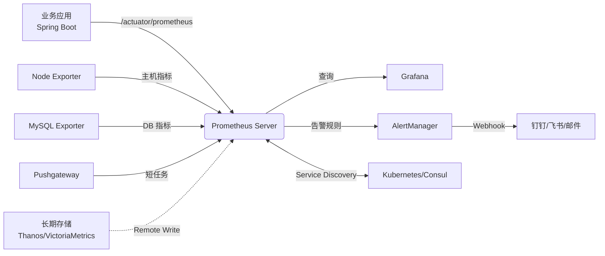
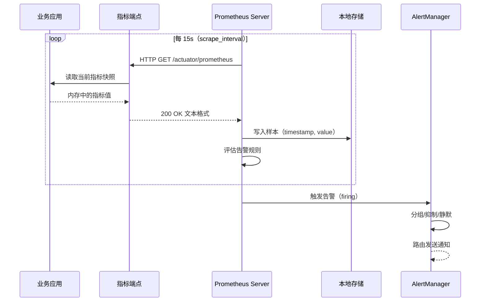
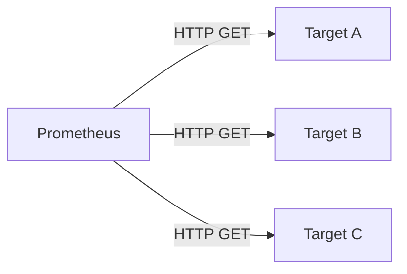
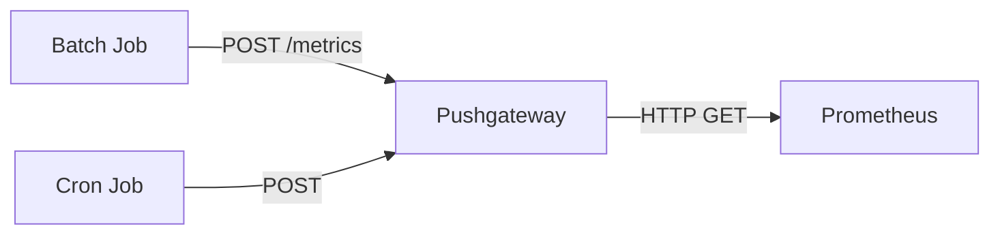
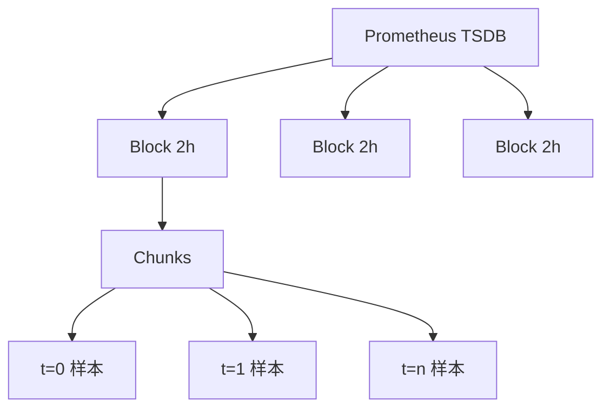
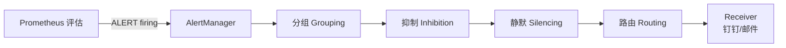
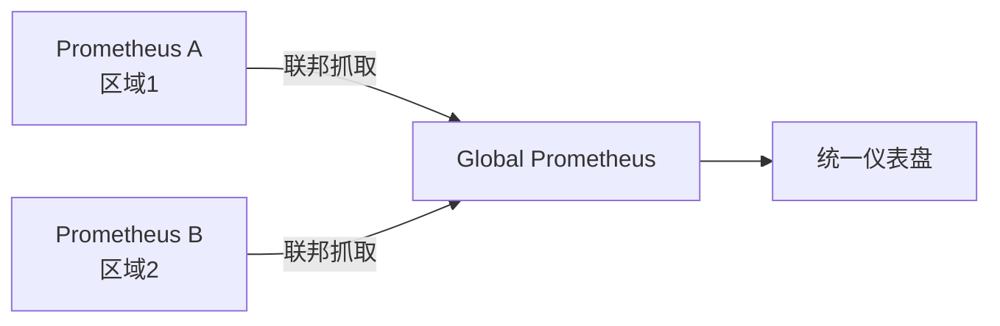

# Prometheus

Prometheus 是云原生时代最主流的开源**时序监控告警系统**，由 SoundCloud 开源，后加入 CNCF（云原生计算基金会），是 Kubernetes 监控的事实标准。本文档系统介绍 Prometheus 的作用及实现原理。


<!-- more -->

## 1. Prometheus 的作用

### 1.1 核心定位

| 维度 | 说明 |
|------|------|
| **类别** | 时序数据库（TSDB）+ 监控告警系统 |
| **数据模型** | 多维时间序列（带标签的指标） |
| **采集方式** | Pull 主动拉取（HTTP 协议） |
| **查询语言** | PromQL（函数式查询语言） |
| **存储** | 内置本地 TSDB，可对接远程存储 |
| **告警** | 独立的 AlertManager 组件 |
| **可视化** | 自身提供基础 UI，通常与 Grafana 配合 |

### 1.2 主要能力

!!! tip "四大核心能力"
    - **指标采集**：定时从目标 HTTP 端点拉取指标<br>
    - **数据存储**：将指标以时间序列的形式存储在本地或远端<br>
    - **数据查询**：通过 PromQL 进行多维聚合、计算、过滤<br>
    - **告警通知**：基于 PromQL 配置告警规则，由 AlertManager 路由通知

### 1.3 适用场景

| 场景 | 适用度 | 说明 |
|------|--------|------|
| **容器/K8s 监控** | ⭐⭐⭐⭐⭐ | 云原生首选，与 K8s 生态深度集成 |
| **微服务监控** | ⭐⭐⭐⭐⭐ | 多维标签适合微服务维度分析 |
| **业务指标监控** | ⭐⭐⭐⭐ | QPS、订单量、支付成功率等 |
| **告警系统** | ⭐⭐⭐⭐⭐ | 灵活的告警规则与去重分组 |
| **短生命周期任务** | ⭐⭐ | 需借助 Pushgateway |
| **APM/调用链追踪** | ⭐⭐ | 不擅长，APM 用 Jaeger/SkyWalking |
| **日志分析** | ❌ | 不适合，日志用 ELK/Loki |

### 1.4 与同类对比

| 特性 | Prometheus | Zabbix | InfluxDB | Grafana Mimir |
|------|-----------|--------|----------|---------------|
| **数据模型** | 多维标签 | 主机/项 | 单标签 | 多维标签 |
| **采集方式** | Pull | Agent/Proxy | 多种 | Pull |
| **生态** | 云原生 | 老牌运维 | IoT 时序 | 多 Prometheus 联邦 |
| **告警** | AlertManager | 内置 | Kapacitor | 内置 |
| **存储扩展** | 远端存储 | DB | 内置 | 对象存储 |

## 2. 整体架构

### 2.1 生态组件



### 2.2 核心组件说明

| 组件 | 作用 |
|------|------|
| **Prometheus Server** | 核心，负责抓取、存储、查询 |
| **Exporters** | 指标暴露器，把第三方系统指标转为 Prometheus 格式 |
| **Pushgateway** | 短生命周期任务的代理推送 |
| **AlertManager** | 告警去重、分组、路由、抑制 |
| **Grafana** | 可视化仪表盘（最常用搭配） |
| **Client Libraries** | 各语言的 SDK（Go、Java、Python 等） |

### 2.3 抓取流程



## 3. 数据模型

### 3.1 指标（Metric）

每条样本由三个部分组成：

```
指标名 + 标签集 + 样本值（含时间戳）
```

```promql
http_server_requests_seconds_count{application="demo",method="GET",uri="/list",status="200"} 42 1717740000000
```

| 部分 | 说明 | 示例 |
|------|------|------|
| **指标名** | 描述被测量的事物（动词或名词） | `http_server_requests_seconds_count` |
| **标签（Labels）** | 标识该样本的维度特征 | `application`, `method`, `uri`, `status` |
| **值（Value）** | 当前测量值（浮点） | `42` |
| **时间戳（Timestamp）** | 毫秒级 Unix 时间戳 | `1717740000000` |

### 3.2 标签（Labels）

标签是 Prometheus 多维数据模型的核心：

!!! tip "标签的作用"
    - **维度切分**：通过标签过滤、聚合、分组<br>
    - **实例区分**：同一指标在多个实例下的区分<br>
    - **业务属性**：env、region、application、version 等

```promql
# 单标签过滤
order_list_total{type="VIP"}

# 多标签过滤
http_server_requests_seconds_count{method="POST",status=~"5.."}

# 标签正则匹配
order_list_total{type!="ALL"}
```

!!! warning "高基数标签反模式"
    - ❌ 标签值是**用户ID、订单ID、邮箱**等无界数据<br>
    - ❌ 时间戳、UUID、IP 直接作为标签<br>
    - ✅ 使用有界枚举（env=prod/dev、method=GET/POST）<br>
    - 原因：高基数会指数级膨胀时间序列数量，撑爆存储

### 3.3 时间序列（Time Series）

> **同一指标名 + 同一组标签 = 一条时间序列**

例如：

```promql
# 这两条是不同的 series
order_list_total{type="ALL"}        # series 1
order_list_total{type="VIP"}        # series 2

# 跨实例相同标签也算不同 series
order_list_total{type="VIP",instance="node1"}  # series 3
order_list_total{type="VIP",instance="node2"}  # series 4
```

## 4. 指标类型

Prometheus 客户端库定义了 4 种核心指标类型：

### 4.1 Counter（计数器）

只能**单调递增**的累计值，重启时归零：

```promql
# 应用启动后所有 HTTP 请求总数
http_server_requests_seconds_count 12345

# 计算请求速率（QPS）
rate(http_server_requests_seconds_count[1m])
```

| 适用场景 | 典型指标 |
|---------|---------|
| 请求总数 | `http_requests_total` |
| 错误总数 | `http_errors_total` |
| 任务完成数 | `tasks_completed_total` |

### 4.2 Gauge（仪表盘）

可**任意上下波动**的瞬时值：

```promql
# 当前 JVM 堆内存使用量
jvm_memory_used_bytes{area="heap"} 524288000

# 当前在线连接数
hikaricp_connections_active 12
```

| 适用场景 | 典型指标 |
|---------|---------|
| 资源使用 | CPU、内存、磁盘、连接数 |
| 队列长度 | `queue_size` |
| 温度等物理量 | 传感器读数 |

### 4.3 Histogram（直方图）

将值分布到**多个桶（bucket）**中统计：

```promql
# 接口耗时直方图（自动生成 _bucket、_count、_sum 三个指标）
http_server_requests_seconds_bucket{le="0.005"} 100
http_server_requests_seconds_bucket{le="0.01"} 150
http_server_requests_seconds_bucket{le="+Inf"} 200
http_server_requests_seconds_count 200
http_server_requests_seconds_sum 1.234
```

!!! tip "Histogram 的常见用法"
    - 计算 P50/P95/P99：`histogram_quantile(0.95, rate(http_server_requests_seconds_bucket[5m]))`<br>
    - 平均耗时：`rate(http_server_requests_seconds_sum[5m]) / rate(http_server_requests_seconds_count[5m])`<br>
    - 注意：直方图分位数是**估算**的，不是精确值

### 4.4 Summary（摘要）

与 Histogram 类似，但**直接计算分位数**（在客户端聚合）：

```promql
# 客户端预先计算好 P50/P90/P99
http_server_requests_seconds{quantile="0.5"} 0.012
http_server_requests_seconds{quantile="0.9"} 0.045
http_server_requests_seconds{quantile="0.99"} 0.123
http_server_requests_seconds_count 200
http_server_requests_seconds_sum 1.234
```

### 4.5 Histogram vs Summary 对比

| 维度 | Histogram | Summary |
|------|-----------|---------|
| **分位数精度** | 估算（桶内均匀分布假设） | 精确（客户端计算） |
| **可聚合性** | ✅ 可跨实例用 `sum` 聚合 | ❌ 不可聚合 |
| **桶配置** | 需预先定义 bucket 边界 | 客户端自动 |
| **性能** | 略高（服务端计算） | 略低（客户端计算） |
| **推荐** | 多数场景 | 客户端已有聚合逻辑时 |

## 5. PromQL 查询语言

### 5.1 数据类型

| 类型 | 说明 | 示例 |
|------|------|------|
| **Instant Vector** | 同一时间点的一组序列 | `up{job="prometheus"}` |
| **Range Vector** | 一段时间内的一组序列 | `up{job="prometheus"}[5m]` |
| **Scalar** | 浮点数值 | `3.14` |
| **String** | 字符串（极少用） | `"hello"` |

### 5.2 常用函数

=== "rate / increase（速率与增量）"

    ```promql
    # 每秒平均增长率（推荐用于 Counter）
    rate(http_server_requests_seconds_count[1m])
    
    # 区间内总增量
    increase(http_server_requests_seconds_count[5m])
    
    # irate：瞬时速率（最后两个点），波动大但灵敏
    irate(http_server_requests_seconds_count[1m])
    ```

=== "sum / avg / max / min（聚合）"

    ```promql
    # 按 application 聚合
    sum by (application) (rate(http_server_requests_seconds_count[1m]))
    
    # 计算平均
    avg by (uri) (rate(http_server_requests_seconds_seconds_sum[1m]))
    ```

=== "histogram_quantile（分位数）"

    ```promql
    # P95 延迟
    histogram_quantile(0.95,
      sum by (le, uri) (rate(http_server_requests_seconds_bucket[5m]))
    )
    
    # P99 延迟
    histogram_quantile(0.99,
      sum by (le, uri) (rate(http_server_requests_seconds_bucket[5m]))
    )
    ```

=== "predict_linear（预测）"

    ```promql
    # 预测 4 小时后磁盘是否将写满
    predict_linear(node_filesystem_avail_bytes{mountpoint="/"}[6h], 4*3600) < 0
    ```

### 5.3 内置常用指标

| 指标 | 用途 |
|------|------|
| `up{job="xxx"}` | 目标是否在线（1 在线，0 离线） |
| `scrape_duration_seconds` | 抓取耗时 |
| `scrape_samples_scraped` | 每次抓取的样本数 |
| `__name__` | 指标名（标签操作符） |
| `ALERTS` | 当前告警状态 |
| `ALERTS_FOR_STATE` | 告警持续时长 |

## 6. Pull vs Push 模式

### 6.1 Pull 模式



| 优势 | 劣势 |
|------|------|
| 中心化控制抓取频率 | 目标需暴露 HTTP 端点 |
| 自动健康检测（`up`指标） | NAT/防火墙穿透困难 |
| 目标可水平扩展 | 短生命周期任务难处理 |
| 抓取失败立即可见 | 服务发现配置复杂 |

### 6.2 Push 模式（Pushgateway）



!!! warning "Pushgateway 使用准则"
    - ✅ **仅用于短生命周期任务**：批处理、一次性脚本<br>
    - ❌ **不要用作长期指标代理**：会丢失 up 健康检测、目标监控<br>
    - ✅ Push 后必须删除（通过 `pushgateway.client.prometheus.push`）<br>
    - 默认 Pushgateway 不删除，会导致 stale 数据

### 6.3 服务发现

| 类型 | 适用 |
|------|------|
| **静态配置** | `static_configs` 写死 IP |
| **Kubernetes** | 自动发现 Pod、Service、Endpoint |
| **Consul** | 微服务注册中心 |
| **DNS** | SRV 记录 |
| **EC2/GCE** | 云厂商 |
| **file_sd** | 监听 JSON/YAML 文件变化 |

## 7. 存储原理（TSDB）

### 7.1 块（Block）存储



每 2 小时生成一个**Block**目录，包含：

| 文件 | 作用 |
|------|------|
| `chunks/` | 编码压缩后的样本数据 |
| `index` | 指标名/标签的倒排索引 |
| `meta.json` | Block 元信息（min/max 时间、统计） |
| `tombstones` | 已删除样本标记 |

### 7.2 数据压缩

Prometheus 采用**delta-of-delta + Gorilla 压缩**：

| 维度 | 压缩技巧 |
|------|---------|
| **时间戳** | delta-of-delta 编码（增量增量） |
| **浮点值** | XOR 编码（当高低位都不变时跳过） |
| **标签名** | label name 字典化（避免重复字符串） |
| **样本块** | 默认 120 个样本为一个 chunk |

!!! tip "压缩效果"
    实际数据压缩比通常可达 **1:10 ~ 1:20**（原始 16 字节/样本 → 平均 1.6 字节/样本）

### 7.3 WAL（预写日志）


!!! note "WAL 作用"
    - 进程崩溃时通过 WAL 恢复未落盘数据<br>
    - WAL 文件位于 `data/wal/`，每 1024 字节一段<br>
    - 默认 checkpoint 阈值，触发后重放

### 7.4 保留策略

```bash
# 启动参数
--storage.tsdb.retention.time=15d      # 保留 15 天
--storage.tsdb.retention.size=50GB     # 最大占用 50GB
```

## 8. 告警机制

### 8.1 告警流程



### 8.2 告警规则示例

```yaml
# prometheus.rules.yml
groups:
  - name: example
    rules:
      # 告警规则
      - alert: HighRequestLatency
        expr: |
          histogram_quantile(0.95,
            sum by (le, uri) (rate(http_server_requests_seconds_bucket[5m]))
          ) > 1
        for: 5m                    # 持续 5 分钟才触发
        labels:
          severity: warning
        annotations:
          summary: "P95 延迟过高: {{ $labels.uri }}"
          description: "{{ $labels.uri }} P95 = {{ $value }}s"

      # 记录规则（预计算）
      - record: service:request_rate:5m
        expr: |
          sum by (service) (rate(http_server_requests_seconds_count[5m]))
```

### 8.3 AlertManager 配置

```yaml
# alertmanager.yml
route:
  receiver: 'default'
  group_by: ['alertname', 'cluster']
  group_wait: 30s
  group_interval: 5m
  repeat_interval: 4h
  routes:
    - matchers:
        - severity="critical"
      receiver: 'oncall-pager'

receivers:
  - name: 'default'
    webhook_configs:
      - url: 'https://oapi.dingtalk.com/robot/send?access_token=xxx'
  
  - name: 'oncall-pager'
    pagerduty_configs:
      - service_key: 'xxx'
```

### 8.4 关键概念

| 概念 | 说明 |
|------|------|
| **Alert** | 一个告警规则触发时产生的实例 |
| **Group** | 按 `group_by` 分组后批量发送 |
| **Inhibition** | 高严重度告警抑制低严重度（如服务宕机抑制慢查询告警） |
| **Silences** | 临时静默某类告警（如维护窗口） |
| **for clause** | 持续时间，过滤瞬时抖动 |

## 9. Spring Boot 集成

### 9.1 依赖引入

```xml
<dependency>
    <groupId>org.springframework.boot</groupId>
    <artifactId>spring-boot-starter-actuator</artifactId>
</dependency>
<dependency>
    <groupId>io.micrometer</groupId>
    <artifactId>micrometer-registry-prometheus</artifactId>
</dependency>
```

### 9.2 application.yaml

```yaml
management:
  endpoints:
    web:
      exposure:
        include: prometheus,health,info
  endpoint:
    prometheus:
      enabled: true
  metrics:
    tags:
      application: ${spring.application.name}
    distribution:
      percentiles-histogram:
        http.server.requests: true   # 开启耗时直方图
      percentiles:
        http.server.requests: 0.5,0.95,0.99
```

### 9.3 自定义指标

=== "Counter"

    ```java
    @RestController
    public class OrderController {
        // 注入 MeterRegistry
        private final Counter orderCounter;
        
        public OrderController(MeterRegistry registry) {
            this.orderCounter = Counter.builder("order_total")
                .tag("biz", "order")
                .description("订单总数")
                .register(registry);
        }
        
        @PostMapping("/create")
        public Result<String> create() {
            orderCounter.increment();  // 计数 +1
            return Result.ok();
        }
    }
    ```

=== "Gauge"

    ```java
    @Component
    public class QueueSizeGauge {
        private final Queue<String> queue = new ConcurrentLinkedQueue<>();
        
        public QueueSizeGauge(MeterRegistry registry) {
            // 弱引用，自动跟踪 queue.size()
            Gauge.builder("queue_size", queue, Queue::size)
                .tag("queue", "orderQueue")
                .register(registry);
        }
    }
    ```

=== "自定义注解 @PrometheusCount"

    ```java
    @Target(ElementType.METHOD)
    @Retention(RetentionPolicy.RUNTIME)
    public @interface PrometheusCount {
        String name();                              // 指标名
        String[] tags() default {};                 // 静态标签
        String[] dynamicTags() default {};          // 动态标签（key=#spel）
    }
    
    @Aspect
    @Component
    public class PrometheusCountAspect {
        private final MeterRegistry registry;
        
        @Around("@annotation(annotation)")
        public Object around(ProceedingJoinPoint pjp, PrometheusCount annotation) throws Throwable {
            Object result = pjp.proceed();
            
            // 构建 Counter（带动态标签的每个值会生成新 series）
            Counter.builder(annotation.name().replace(".", "_"))
                .tags(buildTags(annotation, pjp))
                .register(registry)
                .increment();
            
            return result;
        }
    }
    ```

### 9.4 Prometheus 抓取配置

```yaml
# prometheus.yml
scrape_configs:
  - job_name: 'demo'
    metrics_path: '/actuator/prometheus'
    static_configs:
      - targets: ['116.62.239.67:8084']
        labels:
          application: 'demo'
```

## 10. 进阶特性

### 10.1 联邦（Federation）



```yaml
# 全局 Prometheus 抓取各子 Prometheus
scrape_configs:
  - job_name: 'federate'
    honor_labels: true
    metrics_path: '/federate'
    params:
      'match[]':
        - '{job="demo"}'
        - '{__name__=~"job:.*"}'   # 预聚合指标
    static_configs:
      - targets: ['prom-a:9090', 'prom-b:9090']
```

### 10.2 长期存储

| 方案 | 特点 |
|------|------|
| **Thanos** | 兼容 Prometheus，无限保留，支持降采样 |
| **VictoriaMetrics** | 性能更强，存储更紧凑 |
| **Cortex** | 多租户长期存储 |
| **InfluxDB** | 通用 TSDB，需 Promxy 桥接 |
| **S3/GCS** | 对象存储后端（Thanos/Cortex） |

```yaml
# Prometheus Remote Write 配置
remote_write:
  - url: 'http://thanos-receive:19291/api/v1/receive'
    write_relabel_configs:
      - source_labels: [__name__]
        regex: 'go_.*|process_.*'
        action: drop    # 丢弃不关心的指标
```

### 10.3 录制规则（Recording Rules）

预计算复杂 PromQL，结果作为新指标：

```yaml
groups:
  - name: recording.rules
    rules:
      - record: job:http_requests:rate5m
        expr: |
          sum by (job) (rate(http_server_requests_seconds_count[5m]))
      
      - record: instance:node_cpu:avg5m
        expr: |
          avg by (instance) (rate(node_cpu_seconds_total{mode!="idle"}[5m]))
```

!!! tip "录制规则的作用"
    - 减少查询时计算量<br>
    - 跨 Prometheus 实例可联邦抓取预聚合结果<br>
    - 仪表盘响应更快

## 11. 最佳实践

### 11.1 标签设计

| 准则 | 反例 | 正例 |
|------|------|------|
| **避免高基数** | `user_id`, `email` | `env`, `region`, `tier` |
| **使用枚举** | `method="Get"` | `method="GET"` |
| **统一命名** | `httpRequests`, `http_requests` | `http_requests_total` |
| **业务标签** | 无业务标签 | `biz`, `application`, `version` |

### 11.2 告警设计

!!! tip "好的告警"
    - 阈值合理：避免误报/漏报<br>
    - 持续时间（`for`）：过滤瞬时抖动<br>
    - 有可执行说明：annotations 中给出处理建议<br>
    - 分级合理：critical / warning / info<br>
    - 避免告警风暴：AlertManager 分组抑制

### 11.3 容量规划

| 规模 | 指标 | 节点数 | 存储 |
|------|------|--------|------|
| 小型 | < 1 万 series | 1 节点 | 50GB SSD |
| 中型 | 10 万 series | 2-3 节点联邦 | 200GB SSD |
| 大型 | 100 万+ series | 集群 + 长期存储 | 1TB+ 远端 |

### 11.4 常用 PromQL 模板

```promql
# 错误率（HTTP 5xx 占比）
sum(rate(http_server_requests_seconds_count{status=~"5.."}[5m]))
  /
sum(rate(http_server_requests_seconds_count[5m]))

# Apdex 分数（满意度）
( sum(rate(http_server_requests_seconds_bucket{le="0.3"}[5m]))
+ sum(rate(http_server_requests_seconds_bucket{le="1.2"}[5m]))
) / 2
/
sum(rate(http_server_requests_seconds_count[5m]))

# 业务 QPS
sum by (application) (
  rate(http_server_requests_seconds_count[1m])
)

# 内存使用率
(1 - (node_memory_MemAvailable_bytes / node_memory_MemTotal_bytes)) * 100
```

## 12. 常见问题

### 12.1 `up == 0` 怎么办？

```bash
# 检查抓取目标
curl http://prometheus:9090/api/v1/targets

# 常见原因：
# 1. 网络不通：telnet target_ip 9090
# 2. 端口未暴露：app server.address=0.0.0.0
# 3. 路径错误：metrics_path 是否正确
# 4. 认证：basic_auth、TLS 配置
```

### 12.2 指标太多怎么办？

```yaml
# 1. 丢弃不关心的指标（relabel_configs）
metric_relabel_configs:
  - source_labels: [__name__]
    regex: 'go_gc_.*|process_.*|node_exporter_ml_.*'
    action: drop

# 2. 限制单个 target 样本数
sample_limit: 5000

# 3. 增加分页/分实例抓取
```

### 12.3 存储占满怎么办？

```bash
# 1. 调小保留时间
--storage.tsdb.retention.time=7d

# 2. 减少高基数标签
# 3. 接入远端存储（Thanos/VM）
# 4. 启用分片（Prometheus agent mode）
```

## 13. 参考资料

- [Prometheus 官方文档](https://prometheus.io/docs/)
- [PromQL 官方文档](https://prometheus.io/docs/prometheus/latest/querying/basics/)
- [Awesome Prometheus](https://github.com/roaldnefs/awesome-prometheus)
- [Micrometer Prometheus 文档](https://docs.micrometer.io/micrometer/reference/implementations/prometheus.html)
- [Spring Boot Actuator Metrics](https://docs.spring.io/spring-boot/docs/current/reference/html/actuator.html#actuator.metrics)
